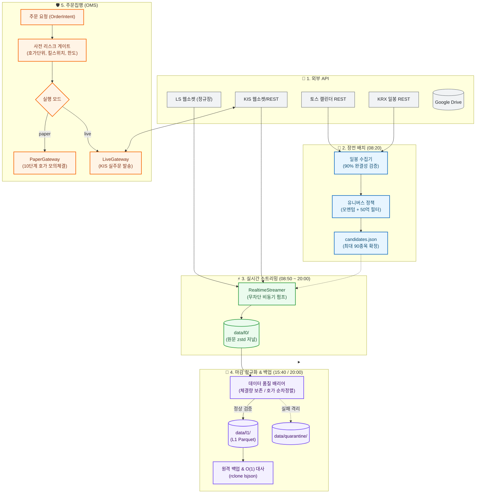

# krx-alpha

> **KRX(KOSPI/KOSDAQ) 고빈도 틱(체결·10단계 호가) 무손실 수집 파이프라인 & 실계좌 섀도 검증 OMS 엔진**


---

## 1. System Highlights

| 핵심 엔지니어링 지표 | 보장 기준 | 아키텍처 불변식 및 강제 장치 |
| :--- | :---: | :--- |
| ⚡ **장중 틱 데이터 손실률** | **`0.00%`** | 파싱 부하 0% 시간대별 무손실 원문 저널(`L0` zstd) append-only 적재 |
| 🛡️ **장중 배포 수집 공백** | **`0건`** | 평일 08:10~22:00 배포 유예(`deploy_gate`) 및 야간 이관 |
| 📐 **아키텍처 불변식 위반** | **`0건`** | pytest AST 정적 파싱으로 상위 레이어 역참조·경로 리터럴 0건 강제 |
| 💾 **스토리지 자율 순환** | **`~1.0 GB 캡`** | Google Drive 원격 파일 크기 100% 일치(바이트 대사) 시에만 로컬 삭제 |
| ⏱️ **NTP 시각 오차(Drift) 한도** | **`≤ 2.0s`** | 5회 샘플 중간값 실측 기반 장애 시 즉시 안전 차단 (Fail-Closed, `ClockUnsyncedError`) |
| 🔒 **주문 누출 리스크** | **`0.00%`** | 모의(Paper) 모드 거래소 소켓 차단 + 10단계 호가 잔량 모의 소진 |

---

## 2. Tech Stack

| 분류 | 기술 | 채택 근거 |
| :--- | :--- | :--- |
| **Core** | `Python 3.13`, `uv` | 초고속 의존성 관리 및 최신 런타임 성능 최적화 |
| **Data / Storage** | `Polars`, `Parquet`, `zstd` | SIMD 벡터화 DQ 검증, 장중 무지연 압축, 표준 컬럼형 포맷 |
| **Network** | `asyncio`, `websockets`, `httpx` | 비동기 무차단 180쌍 실시간 펌프 및 Token Bucket 레이트리미터 |
| **Settings** | `Pydantic v2` | 설정 단일 소스(SSOT) 및 Fail-Closed 환경변수 검증 |
| **Infra / Ops** | `Docker Compose`, `rclone` | 24/7 무인 컨테이너 구동 및 Google Drive $O(1)$ 대사 백업 |
| **Quality** | `pytest`, `Python AST` | 코드베이스 계층 위계 및 불변식 정적 강제 |

---

## 3. Daily Workflow & Pipeline

데몬이 24시간 동안 수행하는 4단계 수집 및 주문 처리 흐름입니다.

| 시각 (KST) | 단계 | 핵심 처리 내용 |
| :---: | :--- | :--- |
| 🌅 **08:20** | **장전 배치** | 토스 캘린더 영업일 확인 $\to$ KRX 일봉 수집 $\to$ **당일 모멘텀·유동성 90종목 선별** (`candidates.json`) |
| ⚡ **08:50** | **장중 수집** | NTP 시각 검증 $\to$ LS(180쌍)/KIS 웹소켓 수신 $\to$ **원문 zstd 저널(`L0`) append-only 적재** |
| 🌙 **15:40** | **장마감 배치** | 틱 체결량 보존·호가 순차정렬(단조성) 품질(DQ) 검증 $\to$ **정제된 L1 Parquet 변환** $\to$ GDrive 대사 후 로컬 삭제 |
| 🛡️ **수시** | **주문집행** | 사전 리스크 게이트 검증 $\to$ **10호가 잔량 모의체결(Paper)** 또는 **KIS 실계좌 전송(Live)** |



---

## 4. Top 5 Engineering Invariants (핵심 챌린지)

### 1. 장중 무손실 L0 저널 & 애프터마켓 세션 분리
* 🚨 **문제**: 장중 JSON 파싱 부하로 인한 틱 유실, 16~20시 애프터마켓 체결이 정규장 파티션에 섞이는 시계열 오염.
* 📐 **원칙**: 장중 파싱 0% 유지, 세션 소속은 파일명이 아닌 거래소 시각(`exchange_event_time`) 단일 소스로 판정.
* 💡 **해결**: append-only zstd 저널(원시 데이터 계층 `L0`)에 원문 적재 후, EOD에 세션 구간(`market_phase`) 부여 및 LS/KIS 디코더 분리 검증.

### 2. 시계열 인과성 & Look-Ahead Bias 원천 차단
* 🚨 **문제**: 클라우드 VPS 클럭 드리프트(+1000ms)로 인한 틱 순서 역전, 미래 일봉 데이터 혼입에 따른 백테스트 왜곡.
* 📐 **원칙**: 경과시간 계측용 단조시각과 타임스탬프용 절대시각(UTC) 병기, $T$ 시점 유니버스는 strictly $T-1$ 거래일 종가까지만 참조.
* 💡 **해결**: NTP 5회 샘플 오프셋 2.0초 초과 시 세션 기동 차단(`ClockUnsyncedError`), 미래 일봉 발견 시 즉시 중단 Fail-Closed.

### 3. VPS 스토리지 자율 순환 & O(1) 원격 대사
* 🚨 **문제**: 원격 백업 실패 시 데이터 영구 유실 위험, Google Drive 전체 재귀조회 시 EOD 지연 급증 ($O(N)$).
* 📐 **원칙**: 원격 파일 바이트 크기가 로컬과 100% 일치함을 입증하기 전에는 로컬 원본을 절대 삭제하지 않음.
* 💡 **해결**: 원격 저장소 단건 파일 크기 비교(대사) 후 로컬 순환 삭제 (Offload-before-Delete), 잔여 3GB 미만 시 수집 안전 차단.

### 4. 장중 무중단 배포 & PID 1 데몬 안전 종료
* 🚨 **문제**: 도커 PID 1 데몬의 SIGTERM 무시로 인한 강제 SIGKILL, 장중 배포 푸시로 인한 실시간 틱 수집 공백.
* 📐 **원칙**: 정규장 및 애프터마켓 거래 시간(평일 08:10~22:00)에는 수집 컨테이너 재생성을 엄격히 금지.
* 💡 **해결**: 장중 배포 유예(`deploy_gate`) 후 22:00 야간 타이머로 이관, 데몬에 SIGTERM 전파기 및 20초 종료 데드라인 적용.

### 5. 금융 안전 주문집행 (Dual Gateway)
* 🚨 **문제**: 모의/실전 코드 분리로 인한 프로덕션 전환 시 구현 불일치 및 오주문 사고 위험.
* 📐 **원칙**: 동일 OMS 인터페이스와 동일 사전 리스크 게이트를 강제, 실전 주문은 이중 안전 확인(Dual-Arming) 플래그 필수.
* 💡 **해결**: `PaperGateway`는 실시간 10단계 호가 잔량을 소진하는 모의체결 적용, `LiveGateway`는 환경변수 미충족 시 인스턴스화 차단.

---

## 5. Architecture Layer Contracts (Layer 0 to 7)

모든 모듈은 엄격한 계층 랭크(`LAYER_RANK`)를 준수하며, pytest AST 정적 분석으로 상위 레이어 역참조를 기계적으로 차단합니다.

```text
Layer 7: CLI 진입점 (collect_*, bars_refresh, universe_plan, order, main)
   ↓
Layer 6: 오케스트레이션 및 주문 서비스 (daemon, execution service)
   ↓
Layer 5: 감독 및 워크플로 엔진 (supervisor, eod, execution/oms, deploy/trading gates)
   ↓
Layer 4: 유스케이스 서비스 및 게이트웨이 (marketdata/universe service, streamer, execution gateways)
   ↓
Layer 3: 벤더 로우 클라이언트 및 어댑터 (LS 어댑터, KIS 클라이언트, normalize worker)
   ↓
Layer 2: 저장소 영속화 및 품질 배리어 (journal, normalization, quality, retention, remote, risk, ledger)
   ↓
Layer 1: 도메인 계약 및 규칙 정의 (bars, calendar, universe policy, realtime contracts, execution contracts)
   ↓
Layer 0: 시스템 기반 및 스키마 (config, calendar, errors, symbols, paths, observability)
```

---

## 6. Quick Start & Verification

```bash
# 1. 의존성 설치 및 테스트 실행
uv sync
uv run pytest

# 2. CLI 실행 예시
uv run python -m src.cli.main bars-refresh --store-path data/bars/daily.parquet --ref-date 2026-09-12
uv run python -m src.cli.main universe-plan --bars-path data/bars/daily.parquet --decision-date 2026-09-11
uv run python -m src.cli.main order --symbol 005930 --side buy --qty 10 --type limit --price 70000

# 3. 24/7 데몬 무인 구동
docker compose up -d
```

---

## 7. Architecture Documentation Index

* **[System Design Specification](docs/architecture/system-design.md)**: 시스템 경계, 24/7 상태머신, 3계층 스토리지 스키마, 세션 분류, 8계층 계약.
* **[Architectural Decision Records (ADRs)](docs/architecture/engineering-decisions.md)**: 8대 핵심 기술 결정 및 트레이드오프 심층 분석.
* **[Multi-Broker OpenAPI Specifications](docs/architecture/brokers/api_master.md)**: KIS, LS, 키움, 토스 4대 증권사 API 한도 및 스펙 매트릭스.
* **[Generated Code Map](docs/code_map.json)**: 전체 모듈 레이어 랭크 및 테스트 매핑 탐색 지도.

---

## 8. Scope & Boundaries

1. **당일 90종목 고정 수집**: 웹소켓 재구독 프레임 유실 방지 및 브로커 연결 한도(200쌍) 준수를 위해 당일 유니버스는 장전 고정 유지.
2. **Paper 모의체결 한계**: 호가 잔량을 소진하여 체결하므로, 호가창 내 내 주문의 대기열 우선순위 및 시장 충격은 완벽히 반영되지 않음.
3. **주문 지원 범위**: 한국투자증권(KIS) OpenAPI 기반 KRX 정규장 현물 주식(KOSPI/KOSDAQ) 보통가/시장가 현금 매수·매도 한정.
