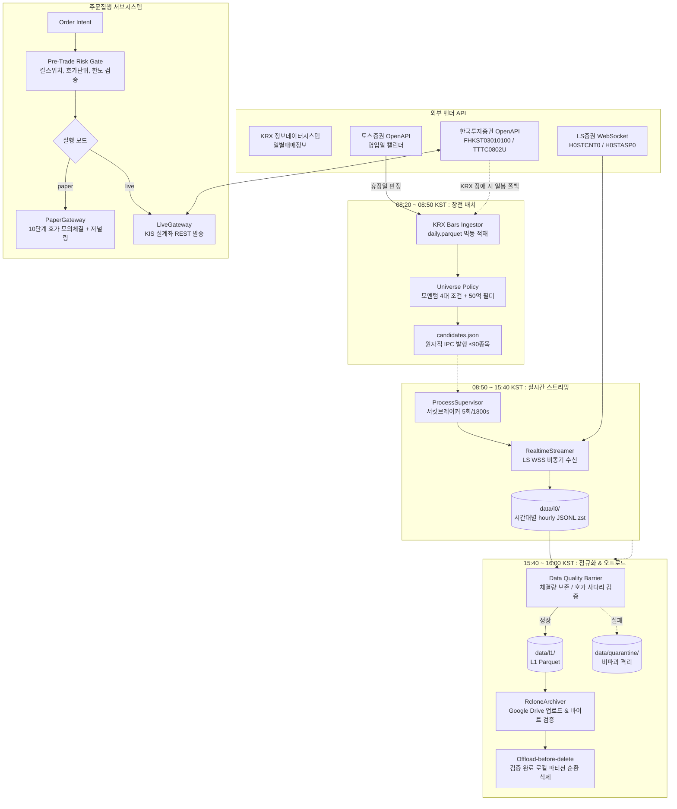

# krx-alpha

KRX(KOSPI/KOSDAQ) 고빈도 틱(체결·10단계 호가) 데이터 수집·정규화 인프라 및 실계좌 섀도 검증 기반 주문집행(OMS) 엔진.

---

## 1. Project Overview

`krx-alpha`는 국내 주식 시장의 고빈도 단타 전략을 위한 **24/7 실시간 틱 데이터 수집 파이프라인**과 **사전 리스크 게이트가 결합된 주문집행(OMS) 엔진**입니다.

리테일 증권사 API의 엄격한 웹소켓 구독 용량(약 100종목/200스트림 쌍) 및 클라우드 VPS의 제한된 자원(RAM 500MB, 슬라이딩 디스크 3GB 워터마크) 환경에서, 장전 일봉 기반 단타 유니버스(최대 90종목)를 자동 선별하여 무손실 실시간 틱 저널을 구축합니다. 장마감 후에는 틱 보존법칙과 호가 사다리 정합성을 검증하여 L1 Parquet로 변환하고 Google Drive로 영구 이중화한 뒤 스토리지를 순환합니다. 또한 한국투자증권(KIS) 실계좌 OpenAPI와 연동하되, 실전 주문 전송 전 10단계 호가 잔량을 소진하는 모의체결(`paper_l10_sweep_v1`)과 전송 전문 저널링을 제공합니다.

---

## 2. Why This Project / Problem

1. **리테일 API의 물리적 구독 한도와 전종목 수집의 불가능성**: 국내 전종목(2,500+)의 실시간 틱/호가를 동시 수집하는 것은 증권사 웹소켓 세션 한도(LS: 200쌍, KIS: 41쌍)상 불가능합니다. 따라서 모멘텀과 유동성을 사전에 선별하여 브로커 기술용량 내로 압축하는 2단계 수집 전략이 필수적입니다.
2. **시계열 Look-Ahead Bias 차단**: 유니버스 선정 피처 계산 시 당일 및 미래 데이터가 혼입되면 백테스트 수익률이 왜곡됩니다. $T-1$ 거래일 종가까지만 엄격히 참조하는 시점 검증기가 요구됩니다.
3. **가상머신/컨테이너 클럭 드리프트**: WSL2나 클라우드 VPS는 호스트 절전 및 하이퍼바이저 타임슬라이싱으로 시스템 시계가 실제보다 +1000ms 이상 틀어질 수 있습니다. 고빈도 틱 데이터의 시계열 역전을 방지하기 위한 외부 타임서버(NTP) 오프셋 검증이 필요합니다.
4. **저사양 VPS 디스크 고갈과 데이터 영구 유실 딜레마**: 원시 틱 스트림은 빠르게 디스크를 점유하지만, 단순 기간 경과로 삭제하면 정규화나 백업 실패 시 원본이 영구 소실됩니다. 정규화 및 원격 바이트 크기 일치가 입증된 파일만 안전하게 순환 삭제하는 보증 구조가 필요합니다.
5. **실전 알고리즘 트레이딩의 주문 누출 위험**: 개발/검증 단계에서 실수로 거래소에 시장가 실주문이 전송되는 금융 사고를 방지하기 위해, 동일한 OMS 인터페이스 위에서 실전 전송기(`LiveGateway`)와 완벽히 격리된 실계좌 섀도 모의체결(`PaperGateway`)이 요구됩니다.

---

## 3. Key Features

* **2단계 유니버스 압축 파이프라인**: 장전(08:20) 공식 KRX 일봉을 수집해 상한가·급등·거래대금급증·신고가 조건과 50억 유동성 필터를 통과한 최대 90종목을 선정함으로써, LS증권 단일 커넥션 용량(200쌍) 내에 실시간 틱/호가 수집을 100% 수용합니다.
* **장중 무손실 L0 저널링**: 이벤트 루프 블로킹을 방지하기 위해 장중에는 원문 그대로를 나노초 시각(단조시계 + 벽시계) 및 연결 시퀀스와 함께 시간대별 zstd 압축 JSONL(`L0`)에 append-only로 적재합니다.
* **EOD 사후 무결성 배리어 & 비파괴 격리**: 장마감 후 Polars 벡터 연산으로 누적체결량 보존법칙($\Delta checnt \le 1$ 구간의 $\Delta volume > cvolume$ 틱 손실 검출), 가격제한폭($\pm 30\%$), 10단계 호가 사다리 단조성을 검증하고, 실패한 파티션은 삭제하지 않고 `quarantine/`으로 이동 보존합니다.
* **Offload-before-Delete 원격 이중화**: 정규화된 L1 Parquet를 rclone CLI로 Google Drive에 업로드한 뒤, `rclone lsjson`으로 원격 파일 크기가 로컬과 일치함을 확인한 경우에만 로컬 L0/L1을 순환 삭제하여 무인 디스크 캡(~1GB 내외)을 유지합니다.
* **NTP 실측 기반 Fail-Closed 클럭 게이트**: 세션 부트스트랩 시 `kr.pool.ntp.org`의 중간값 오프셋을 실측하여 2초 초과 또는 통신 불가 시 프로세스 시작을 즉시 거부(`ClockUnsyncedError`)합니다.
* **Dual Order Gateway (Paper 섀도 vs Armed Live)**: KIS 실계좌 잔고를 조회하되 거래소 전송 없이 10단계 호가창 잔량을 소진하는 모의체결(`paper_l10_sweep_v1`)과 전송 전문 저널링을 제공하며, 실전 주문은 `KRX_ALPHA_EXEC_LIVE_ARMED=true` 환경변수가 없으면 초기화 단계에서 차단됩니다.
* **정적 AST 분석 기반 아키텍처 불변식 가드**: 계층 순환 0건, 상위 레이어 역참조 0건, 설정 파일(`src/core/config.py`) 외부의 파일시스템 경로 리터럴 및 `os.environ` 직접 접근 0건을 pytest 단계에서 정적으로 강제합니다.

---

## 4. Architecture



---

## 5. End-to-End Flow

| 단계 | 실행 시각 (KST) | 처리 내용 | 주요 모듈 및 파일 경로 |
| :--- | :--- | :--- | :--- |
| **1. 영업일 검증** | 08:20:00 | 토스 마켓 캘린더 조회로 휴장일 여부 선제 판정 | [`src/marketdata/toss_calendar.py`](file:///home/kth/krx-alpha/src/marketdata/toss_calendar.py) |
| **2. 일봉 데이터 갱신** | 08:20:05 | KRX 공식 API로 일봉 수집 (장애 시 KIS REST 일봉 1회 폴백) | [`src/marketdata/krx_bars.py`](file:///home/kth/krx-alpha/src/marketdata/krx_bars.py), [`src/marketdata/service.py`](file:///home/kth/krx-alpha/src/marketdata/service.py) |
| **3. 유니버스 선정** | 08:21:00 | 롤링 피처 계산, 4대 모멘텀 조건 + 50억 유동성 필터, 원자적 IPC 기록 | [`src/universe/policy.py`](file:///home/kth/krx-alpha/src/universe/policy.py), [`src/universe/ipc.py`](file:///home/kth/krx-alpha/src/universe/ipc.py) |
| **4. 세션 부트스트랩** | 08:50:00 | NTP 타임서버 오프셋 검증, 세션 매니페스트 초기화, 디스크 워터마크(3GB) 확인 | [`src/realtime/clock.py`](file:///home/kth/krx-alpha/src/realtime/clock.py), [`src/realtime/session.py`](file:///home/kth/krx-alpha/src/realtime/session.py) |
| **5. 실시간 스트리밍** | 08:50 ~ 15:40 | LS 웹소켓 수신, 180스트림 쌍 구독, 시간대별 zstd 압축 L0 저널 저장 | [`src/realtime/adapters/ls.py`](file:///home/kth/krx-alpha/src/realtime/adapters/ls.py), [`src/realtime/streamer.py`](file:///home/kth/krx-alpha/src/realtime/streamer.py) |
| **6. 스트리머 정상종료** | 15:40:00 | 데몬 감독기가 스트리머에 SIGTERM 전송 (15초 타임아웃 초과 시 SIGKILL) | [`src/orchestration/supervisor.py`](file:///home/kth/krx-alpha/src/orchestration/supervisor.py) |
| **7. L1 정규화 & DQ** | 15:40:30 | L0 역압축, `(conn_id, conn_seq)` 충돌 검증, 틱 보존법칙/호가 단조성 검증, L1 Parquet 생성 | [`src/storage/quality.py`](file:///home/kth/krx-alpha/src/storage/quality.py), [`src/storage/retention.py`](file:///home/kth/krx-alpha/src/storage/retention.py) |
| **8. 원격 백업 & 순환** | 15:45:00 | Google Drive(rclone) 업로드, 원격 크기 확인 후 로컬 L0(3일)/L1(30일) prune | [`src/storage/remote.py`](file:///home/kth/krx-alpha/src/storage/remote.py), [`src/orchestration/eod.py`](file:///home/kth/krx-alpha/src/orchestration/eod.py) |
| **9. 주문집행 (독립)** | 필요 시 수시 | 사전 리스크 검증 통과 후 Paper 10단계 호가 모의체결 또는 Live KIS 발송 | [`src/execution/risk.py`](file:///home/kth/krx-alpha/src/execution/risk.py), [`src/execution/gateways.py`](file:///home/kth/krx-alpha/src/execution/gateways.py), [`src/execution/oms.py`](file:///home/kth/krx-alpha/src/execution/oms.py) |

---

## 6. Repository Structure

```text
src/
├── core/              # 시스템 기반: 설정/경로 단일소스, 정규장 세션 캘린더, 공용 예외
├── marketdata/        # 배치 수집: KRX 공식 일봉, 토스 캘린더 게이트, KIS 일봉 폴백
├── universe/          # 유니버스 정책: 롤링 피처 생성, 모멘텀/유동성 필터, 원자적 IPC
├── realtime/          # 실시간 수집: NTP 클럭 게이트, LS 웹소켓 어댑터, 스트리머 루프
├── storage/           # 저장소 계층: L0 저널 쓰기, 데이터 품질 배리어, 보존/격리, rclone 백업
├── orchestration/     # 데몬 오케스트레이션: 24/7 상태머신, 프로세스 감독 및 서킷브레이커, EOD 유지보수
├── execution/         # 주문집행: 사전 리스크 게이트, Paper 10단계 호가 모의체결, Live KIS 게이트웨이, OMS 원장
└── cli/               # CLI 진입점: 서브커맨드(bars-refresh, universe-plan, collect-stream, order 등)

configs/               # 환경변수 템플릿 (.env)
docs/
├── architecture/      # 시스템 아키텍처 상세 (overview, data-flow, components, design-decisions)
└── architecture/brokers/ # KIS, LS, 키움, 토스 OpenAPI 역설계 명세
tests/
├── architecture/      # AST 기반 레이어 순환 및 파일 경로 리터럴 불변식 테스트
└── unit/              # 컴포넌트별 단위 테스트 (총 278개 테스트)
```

---

## 7. Technical Decisions

### Decision 1: 장전 일봉 기반 유니버스 선별 (최대 90종목)
* **Why**: 국내 주식 전종목 동시 틱 수집은 리테일 브로커 웹소켓 용량(LS: 200쌍) 한도상 불가능합니다. 당일 단타 대상이 될 유력 종목군(상한가·급등·거래대금급증·신고가 + 50억 필터)을 선별해 브로커 단일 연결에 100% 수용합니다.
* **Trade-off**: 장 시작 후 장중에 갑작스럽게 거래량이 터지는 장중 신규 급등주는 당일 수집 대상에서 제외됩니다.

### Decision 2: 3계층 스토리지 파티셔닝 & Offload-before-Delete 원칙
* **Why**: 장중 수집 루프에서 고부하 데이터 검증 및 Parquet 압축을 수행하면 이벤트 루프가 지연되어 웹소켓 버퍼 오버플로우가 발생합니다. 수집 시점에는 raw 문자열을 zstd 압축 저널에 append-only로 적재하고, 검증과 Parquet 변환은 장마감 후 배치로 분리합니다.
* **Trade-off**: EOD 시점에 L0 역압축, 데이터 품질 검증, Parquet 압축을 일괄 수행하기 위한 일시적 CPU 연산이 요구됩니다.

### Decision 3: NTP 실측 기반 Fail-Closed 클럭 게이트
* **Why**: 클라우드 가상머신 및 WSL2 환경의 로컬 시스템 시계는 실제 시각과 +1000ms 이상 어긋날 수 있으며, 이는 고빈도 틱 시계열 역전 및 타임스탬프 왜곡을 야기합니다.
* **Trade-off**: 세션 부트스트랩 시 외부 NTP 서버(UDP 123) 연결이 필수적이며, 네트워크 단절 시 수집이 시작되지 않습니다.

### Decision 4: 단일 OMS 위 Dual Gateway 분기 (Paper 섀도 vs Live 무장)
* **Why**: 개발 단계의 모의 로직과 실전 주문 로직이 별도 코드로 존재할 경우 프로덕션 전환 시 구현 불일치로 인한 금융 사고 위험이 높습니다. 동일한 OMS와 리스크 게이트 아래 전송기만 분기하되, Paper 모드는 실계좌 조회 + 10단계 호가 잔량 모의체결(`paper_l10_sweep_v1`)을 적용하고, Live 모드는 `KRX_ALPHA_EXEC_LIVE_ARMED=true` 없이는 인스턴스화조차 거부합니다.
* **Trade-off**: Paper 체결 모델은 호가창 내 내 주문의 대기열 우선순위(Queue Position) 및 시장 충격(Market Impact)을 완벽히 모사하지는 못합니다.

### Decision 5: 정적 AST 분석 기반 아키텍처 불변식 테스트
* **Why**: AI 페어 프로그래밍 및 지속적 리팩토링 과정에서 모듈 간 상위 레이어 역참조, 순환 의존, 하드코딩된 임의 경로 생성이 누적되어 아키텍처가 침식되는 것을 방지합니다.
* **Trade-off**: 새로운 모듈을 추가할 때 반드시 `tests/architecture/layers.py`의 `LAYER_RANK` 계약 테이블을 갱신해야 합니다.

---

## 8. Validation / Reliability

* **Unit & Architecture Tests**: 278개의 단위 및 아키텍처 검증 테스트가 8.2초 내에 통과합니다 (`tests/architecture/test_layering.py` 포함).
* **Look-Ahead Bias 차단**: 유니버스 선정 함수(`select_universe`)는 인자로 전달된 `decision_date`를 초과하는 데이터가 1건이라도 발견되면 즉시 `ValueError`로 중단됩니다.
* **Fail-Closed 방어벽**:
  * 슬롯 예산 초과 (`SlotBudgetExceededError`)
  * 필수 자격증명 누락 (`MissingCredentialsError`)
  * NTP 클럭 2초 초과 드리프트 (`ClockUnsyncedError`)
  * Live 실행 플래그 누락 (`LiveNotArmedError`)
  * 디스크 여유 공간 3GB 미만 (`StorageExhaustedError`)
  * KRX 일봉 수집 직전일 대비 90% 미만 절단 (`ImplausibleRowCountError`)
  * 연결 시퀀스 충돌 (`L1NormalizationError`)
* **비파괴 격리 (Quarantine)**: 손상되었거나 검증에 실패한 L0 파티션은 삭제하지 않고 `data/quarantine/` 디렉터리로 이동하여 원본 증거를 보존합니다.
* **원격 검증 기반 스토리지 순환**: 로컬 L1 Parquet 파일은 Google Drive에 업로드된 후 `rclone lsjson`으로 원격 파일 크기가 바이트 단위까지 일치함이 입증되어야만 삭제됩니다.

---

## 9. Results / Verification Matrix

| 검증 항목 | 검증 방식 | 실측 결과 / 계약 기준 |
| :--- | :--- | :--- |
| **테스트 슈트** | `uv run pytest` | **278 passed** (실행 소요시간 ~8.2s) |
| **아키텍처 레이어 불변식** | AST 정적 파싱 (`test_layering.py`) | 상위 참조 **0건**, 경로 리터럴 위반 **0건**, 환경변수 직접호출 위반 **0건** |
| **수집 유니버스 용량** | `policy.py` 슬롯 예산 가드 | 당일 3~20종목 (하드캡 90종목 $\le$ LS 기술용량 100종목) |
| **스토리지 워터마크** | `shutil.disk_usage` 가드 | 잔여 디스크 **3.0 GB** 미만 시 즉시 쓰기 중단 |
| **클럭 드리프트 허용치** | NTP 5회 샘플 중간값 측정 | 허용 오차 **2.0초** (`2_000_000_000 ns`) 이내 강제 |
| **원격 백업 정합성** | `rclone lsjson` 파일 크기 대사 | 로컬 바이트와 원격 바이트 **100% 일치** 시에만 prune |
| **주문집행 리스크 커버리지** | 시나리오 기반 단위 테스트 | 호가단위 래더, 킬스위치, 손실한도, 호가스윕 등 **34개 시나리오 100% 통과** |

---

## 10. Getting Started

### Prerequisites
* Python 3.11+
* [uv](https://github.com/astral-sh/uv) 패키지 매니저
* (선택) rclone (Google Drive 백업 사용 시)

### 1. Repository Setup & Test Execution
```bash
git clone https://github.com/KTHYEONG/krx-alpha.git
cd krx-alpha

# uv 기반 의존성 설치
uv sync

# 전 테스트 슈트 (278개) 실행
uv run pytest
```

### 2. Environment Configuration
`.env` 파일에 필요한 증권사 OpenAPI 자격증명을 설정합니다:
```bash
# KRX 정보데이터시스템
KRX_OPENAPI_KEY=your_krx_auth_key

# LS증권 (실시간 틱/호가 스트리밍)
LS_APP_KEY=your_ls_app_key
LS_APP_SECRET=your_ls_app_secret

# 토스증권 (영업일 캘린더 게이트)
TOSS_APP_KEY=your_toss_app_key
TOSS_APP_SECRET=your_toss_app_secret

# 한국투자증권 (일봉 폴백 및 주문집행)
KIS_APP_KEY=your_kis_app_key
KIS_APP_SECRET=your_kis_app_secret
KIS_ACCOUNT_NO=your_account_number
KIS_ACCOUNT_PRODUCT_CODE=01
```

### 3. CLI Subcommands Execution
```bash
# 1. KRX 일봉 수집 및 갱신
uv run python -m src.cli.main bars-refresh --store-path data/bars/daily.parquet --market-map-path data/market_map.json --ref-date 2026-09-12

# 2. 유니버스 선정 및 candidates.json 발행
uv run python -m src.cli.main universe-plan --bars-path data/bars/daily.parquet --decision-date 2026-09-11 --out-path data/universe/2026-09-11.parquet --candidates-path data/candidates.json

# 3. 실시간 웹소켓 수집 세션 기동
uv run python -m src.cli.main collect-stream --session-date 2026-09-12 --journal-root data/l0 --manifest-path data/manifest/2026-09-12.json --candidates-path data/candidates.json --market-map data/market_map.json

# 4. Paper 모드 모의 주문 발송
uv run python -m src.cli.main order --symbol 005930 --side buy --qty 10 --type limit --price 70000
```

### 4. 24/7 Daemon Run (Docker Compose)
```bash
docker compose up -d
```

---

## 11. Documentation

시스템 아키텍처 및 내부 설계에 대한 상세 분석 문서는 [`docs/architecture/`](docs/architecture/) 디렉터리에서 확인할 수 있습니다:

* **[Architecture Overview](docs/architecture/overview.md)**: 시스템 목표, 경계, 토폴로지, 24/7 데몬 상태머신, 레이어 계약
* **[Data Flow Specification](docs/architecture/data-flow.md)**: 단계별 데이터 입출력, 스키마, 시계열 무결성 및 금융 정합성 규칙
* **[Component Reference](docs/architecture/components.md)**: 레이어별 서브시스템 책임, 입력/출력, 핵심 클래스 및 함수 매핑
* **[Architectural Decision Records (ADRs)](docs/architecture/design-decisions.md)**: 유니버스 선정, 3계층 스토리지, NTP 클럭 게이트, 듀얼 OMS 설계 배경 및 트레이드오프
* **[Multi-Broker OpenAPI Specifications](docs/architecture/brokers/api_master.md)**: KIS, LS, 키움, 토스 OpenAPI 역설계 분석 및 한도 매트릭스

---

## 12. Limitations & Boundary

1. **전종목 실시간 수집 미지원**: 브로커 웹소켓 세션 용량(200쌍) 및 클라우드 VPS 스토리지 보호를 위해 당일 모멘텀/유동성 90종목으로 한정 수집합니다.
2. **장중 동적 종목 교체 미지원**: 장중 웹소켓 구독 재등록에 따른 프레임 유실을 방지하기 위해 08:20에 결정된 유니버스를 당일 장 마감까지 고정 유지합니다.
3. **Paper 체결 시뮬레이션의 시장 충격 미반영**: `PaperGateway`의 `paper_l10_sweep_v1` 모델은 수신된 10단계 호가 잔량을 소진하는 방식으로 체결량을 계산하므로, 내 주문이 호가 대기열 우선순위(Queue Priority)에 미치는 영향 및 시장 충격(Market Impact)은 완벽히 반영되지 않습니다.
4. **실전 주문(Live) 지원 범위**: 현재 구현된 주문집행 계층은 한국투자증권(KIS) OpenAPI를 통한 KRX 정규장 현물 주식(KOSPI, KOSDAQ)의 보통가(지정가)/시장가 현금 매수·매도만을 지원합니다 (신용/대주/해외주식/선물옵션 제외).
