# Multi-Broker OpenAPI Architecture & Master Routing Specification

> **AI Agent Technical Reference:**  
> This document is the master architectural blueprint and functional routing reference for Korea Investment & Securities (KIS), LS Securities (LS), Kiwoom Securities (Kiwoom), and Toss Securities (Toss). It focuses strictly on API characteristics, quotas, rate limits, session windows, and functional role allocation across the 4 brokers.

---

## 1. Multi-Broker Quota, Rate Limit & Concurrency Matrix

All 4 brokers operate natively on Linux 64-bit via standard HTTPS/OAuth2 protocols.

| Specification Dimension | 한국투자증권 (KIS) | LS증권 (구 이베스트) | 키움증권 (Kiwoom REST NEXT) | 토스증권 (Toss Securities) |
| :--- | :--- | :--- | :--- | :--- |
| **Base URL** | `https://openapi.koreainvestment.com:9443` | `https://openapi.ls-sec.co.kr:8080` | `https://api.kiwoom.com` | `https://openapi.tossinvest.com` |
| **Auth Endpoint** | `POST /oauth2/tokenP` | `POST /oauth2/token` | `POST /oauth2/token` | `POST /oauth2/token` |
| **Payload Format** | `application/json` | `application/x-www-form-urlencoded` | `application/json;charset=UTF-8` | `application/x-www-form-urlencoded` |
| **Token Validity** | 24 hours (`86400`s), disk-cached | 24 hours (`86400`s), memory-cached | 24 hours (`86400`s), memory-cached | 24 hours (`86400`s), memory-cached JWT |
| **Token Concurrency Lock** | asyncio.Lock (single-flight) + atomic 0600 write | Memory lock on refresh | `_token_lock = asyncio.Lock()` | `_token_lock = asyncio.Lock()` |
| **Global Rate Limit (TPS)** | **18.0 req/s** (process-global shared limiter) | **~0.95 req/s** (Strict 1.05s lock) | **5.0 req/s per TR** (dynamic buckets per TR) | **Group-based Limits**: `MARKET_DATA` 15/s, `CHART` 20/s, `ORDER` 10/s, `TREND` 10/s, `RANK` 5/s |
| **Concurrency Model** | Shared limiter (call-site semaphores bound concurrency) | Concurrency = 1 (Single-flight `Lock`) | Dynamic per-TR limiters (Parallel across TRs) | Multi-group token buckets (Independent per group; headers: `X-RateLimit-*`) |
| **Throttling Detection** | Body `"초당 거래건수"` / HTTP 429 | `rsp_cd: "IGW00201"` | HTTP 429 (`return_code: 5, 유량=5`) | HTTP 429 (`Retry-After` header, JSON error) |
| **Nextrade (NXT) Support** | Supported (`FID_COND_MRKT_DIV_CODE="NX"`) | **None** | **Native Supported** (`<CODE>_NX` suffix) | Integrated Calendar & Session Tracking |
| **1m Bar Capacity** | 30 bars/call (intraday) / 120 bars (hist) | **500 bars/call** (1 call = full day) | **900 bars/call** (1 call = full day) | 200 bars/call (2 calls = full day; **20 req/s**) |
| **Tick Capacity** | 30 ticks/call (same-day only) | 500 ticks/call | **900 ticks/call** (30-page budget cap) | 50 ticks/call (REST) / Stream via WSS |
| **Multi-Stock Price Query** | Single stock per call | Up to 50 stocks (concatenated `t8407`) | Single stock per call | **Up to 200 stocks/call** (Comma-separated) |
| **Ranking Capacity** | 30 stocks/call (hard-capped sample) | 100 stocks/call | **200 stocks/page** (up to 1,000 stocks) | 100 stocks/call (realtime & 1d/1w/1mo/1y) |
| **Orderbook & Auction** | **Level-10 + `antc_cnpr` (output1+2)** | Level-10 ask/bid (`t1101`) | Level-10 ask/bid (`ka10004`) | Level-10 ask/bid array (`/orderbook`) |
| **Intraday Investor Estimate**| **Yes (`HHPTJ04160200`, 외인/기관)** | Intraday hourly (`t1405`) | Daily investor trend (`ka10014`) | Daily 7-sector institutional breakdown |
| **Order / Account Trading** | Supported live (`TTTC0802U` 등) | Supported by server (`CSPAT...`) | Supported by server (`kt10...`) | **Modern REST Orders & Server OCO/OTO Triggers** |

---

## 2. Functional API Allocation & Routing Tree

Each analytical and operational task is routed to the optimal broker API based on capacity, latency, and throughput advantages:

```mermaid
flowchart TD
    subgraph MultiQuote [Broad Multi-Stock Price Refresh]
        MQ[price_scanner] -->|1st Choice: 200 stocks/call @ 15 req/s| TS_PRICE[Toss: /api/v1/prices]
        TS_PRICE -.->|Fallback: 50 stocks/call| LS_PRICE[LS: t8407]
    end

    subgraph Decision [Decision-Time Capture @ 15:20 KST]
        D[collect.py] -->|Single Vendor| KIS_DEC[KIS: FHKST01010100 현재가<br/>FHKST01010200 호가/예상체결<br/>HHPTJ04160200 외인/기관추정]
    end

    subgraph Universe [Universe Candidate Discovery]
        U[universe_scan.py] -->|1st Choice: 200행/P 5req/s| KW_SCAN[Kiwoom ka10027]
        U -.->|Master Dump: Full Universe 1-Call| TS_MASTER[Toss: /api/v1/stocks/all]
        KW_SCAN -.->|Fallback: 100 stocks| LS_SCAN[LS: t1489]
        LS_SCAN -.->|Toss Ranking| TS_RANK[Toss: /api/v1/rankings]
    end

    subgraph RegBars [Regular Session 1m Bars 09:00-15:30]
        RB[archive_intraday.py] -->|1st Choice: 1 call per stock| LS_BAR[LS t8412: 500 bars]
        LS_BAR -.->|2nd Choice: 2 calls @ 20 req/s| TS_BAR[Toss: /api/v1/candles]
        TS_BAR -.->|Fallback: 13 calls| KIS_BAR[KIS FHKST03010200: 30 bars]
    end

    subgraph NxtBars [Nextrade 1m Bars Premarket & Aftermarket]
        NB[archive_intraday.py] -->|1st Choice: 1 call per session| KW_BAR[Kiwoom ka10080: _NX 900 bars]
        KW_BAR -.->|Fallback| KIS_NX[KIS FHKST03010200: NX]
    end

    subgraph Ticks [Regular Session Trade Ticks]
        TK[archive_intraday.py] -->|1st Choice: 900 ticks/P| KW_TICK[Kiwoom ka10079: 30P budget]
        KW_TICK -.->|2nd Choice: 500 ticks/P| LS_TICK[LS t8411: CTS cursor]
        LS_TICK -.->|Stream: WebSocket L10| TS_WS[Toss: wss /ws/v1]
        TS_WS -.->|3rd Choice: 30 ticks/P| KIS_TICK[KIS FHPST01060000]
    end

    subgraph Orders [Automated Trading & Execution]
        ORD[Execution Engine] -->|High-Frequency / Live OMS| KIS_ORD[KIS: TTTC0802U 매수/매도<br/>TTTC8434R 잔고조회]
        ORD -->|Server OCO/OTO & Idempotency| TS_ORD[Toss: /api/v1/orders<br/>/api/v1/conditional-orders]
    end
```

### 2.1 Stream-to-API Selection Matrix

| Operational Task | 1st Priority API | 2nd Priority API | 3rd Priority API | Technical Selection Rationale |
| :--- | :--- | :--- | :--- | :--- |
| **Broad Multi-Stock Price Refresh** | **Toss** (`/api/v1/prices`) | **LS** (`t8407`) | **KIS** (`FHKST01010100`) | Toss queries up to 200 stocks in 1 request at 15 req/s (throughput = 3,000 stocks/s). |
| **Universe Master Dump** | **Toss** (`/api/v1/stocks/all`) | **LS** (`t8430`) | *None* | Toss delivers the complete active exchange universe with ISIN codes in 1 clean REST call per market. |
| **Decision Snapshot** (`15:20 KST`) | **KIS** (`FHKST01010100` / `0200` / `HHPTJ04160200`) | *None* | *None* | KIS is the **only** broker providing simultaneous Level-10 ladder, auction match price (`antc_cnpr`), and provisional intraday foreign/institutional flows. |
| **Universe Scan** (Gainers/Losers) | **Kiwoom** (`ka10027`, sole scan vendor) | **Toss** (`/api/v1/rankings`) | **LS** (`t1489`) | Kiwoom returns 401 rows for the 2~10% band in ~0.22s. Toss returns top 100 gainers/losers with structured volume and amounts. |
| **Regular Session 1m Bars** | **LS** (`t8412`) | **Toss** (`/api/v1/candles`) | **KIS** (`FHKST03010200`) | LS retrieves all 390 bars in **1 single call** (`qrycnt=500`). Toss needs only 2 calls with **20 req/s** chart throughput. |
| **NXT Premarket 1m Bars** (`08:00~08:50`) | **Kiwoom** (`ka10080`, `_NX`) | **KIS** (`FHKST03010200`, `NX`) | *None* | Kiwoom retrieves all 50 premarket bars in a single request. |
| **NXT Aftermarket 1m Bars** (`15:40~20:00`)| **Kiwoom** (`ka10080`, `_NX`) | **KIS** (`FHKST03010200`, `NX`) | *None* | Kiwoom retrieves all 260 aftermarket bars in a single request (`qrycnt` up to 900). |
| **Regular Session Trade Ticks** | **Kiwoom** (`ka10079`) | **LS** (`t8411`) | **Toss** (WSS `trade:kr`) / **KIS** (`FHPST01060000`) | Kiwoom yields 900 ticks/call (budget 30P = ~27,000 ticks) > LS yields 500 ticks/call > Toss provides declarative WSS trade streaming. |
| **Historical 1m Bars Backfill** | **KIS** (`FHKST03010230`) | **Toss** (`/api/v1/candles`, cursor `before`)| *None* | KIS server retains ~1 rolling year of historical minute bars. Toss supports backward cursor paging. |
| **Daily OHLCV History** | **KIS** (`FHKST03010100`) | **Toss** (`/api/v1/candles`, `interval=1d`) | **LS** (`t8413`) | KIS & Toss support corporate action-adjusted stock prices. |
| **Short Selling Trend** | **KIS** (`FHPST04830000`) | **Toss** (`/api/v1/stocks/{sym}/short-selling`) | **LS** (`t1481`) | KIS & Toss provide volume, total turnover, and percentage metrics. |
| **Margin Credit Balance** | **KIS** (`FHPST04760000`) | **Toss** (`/api/v1/stocks/{sym}/credit-trades`) | **LS** (`t1482`) | Multi-year margin loan and stock loan balance metrics. |
| **Program Trading Trend** | **KIS** (`FHPPG04650101` / `0201`) | **Toss** (`/api/v1/stocks/{sym}/program-trades`) | **LS** (`t1441` / `t1452`) | Real-time intraday and daily arbitrage/non-arbitrage program flow. |
| **Automated Orders & Risk** | **KIS** (Direct OMS) | **Toss** (REST + Server OCO/OTO) | *None* | Toss provides native server-side conditional orders (`SINGLE`, `OCO`, `OTO`) and 10-minute idempotency keys (`clientOrderId`). |

---

## 3. Session Windows & Venue Syntax

| Venue | Session Window (KST) | Trading Type | KIS Syntax | LS Syntax | Kiwoom Syntax | Toss Syntax |
| :--- | :--- | :--- | :--- | :--- | :--- | :--- |
| **NXT Premarket** | `08:00:00` – `08:50:00` | Continuous Auction | `market_div_code="NX"` | N/A | `stk_cd="005930_NX"` | Handled in `/market-calendar/KR` |
| **KRX Regular** | `09:00:00` – `15:20:00` | Continuous Auction | `market_div_code="J"` | `shcode="005930"` | `stk_cd="005930"` | `symbol="005930"` |
| **KRX Closing Auction** | `15:20:00` – `15:30:00` | Single-Price Auction | `FHKST01010200` (`output2`) | N/A | N/A | Handled in `/market-calendar/KR` |
| **NXT Aftermarket (Order)** | `15:30:00` – `15:40:00` | Order Acceptance | N/A | N/A | N/A | Handled in `/market-calendar/KR` |
| **NXT Aftermarket (Exec)** | `15:40:00` – `20:00:00` | Continuous Auction | `market_div_code="NX"` | N/A | `stk_cd="005930_NX"` | Handled in `/market-calendar/KR` |

---

## 4. Cross-Broker Data Quirks & Unit Invariants

* **Traded Value Units:**
  * **LS Securities:** Bar/tick traded value (`value`) is in **백만원 (1,000,000 KRW)**. Multiply by `1,000,000` to normalize to KRW.
  * **KIS:** `acml_tr_pbmn` is **cumulative KRW (원)**. Compute first difference between consecutive bars to obtain bar value.
  * **Kiwoom:** Synthesize bar value via `close * volume`.
  * **Toss:** Traded amounts return directly in **KRW (원)** as decimal strings (e.g. `"145941219000"`).
* **Number Signs & Representations:**
  * **Kiwoom:** All price and change values return as signed strings (`"+69700"`, `"+8.40"`). Always apply `.abs()` or strip leading signs before numeric casting.
  * **Toss:** All numbers are clean decimal strings without irregular sign prefixes (e.g. `"262000"`, `"-0.0113"`). Cast directly via `Decimal` or `float`.
* **Account-Scoped Request Headers:**
  * **Toss:** Account, Asset, Order, and Conditional Order endpoints require `X-Tossinvest-Account: <accountSeq>`. Omission triggers HTTP 400.
* **Order Safety Invariant:**
  * **Toss:** Any order with gross value >= 100,000,000 KRW strictly requires `confirmHighValueOrder: true`.
* **Static IP Whitelisting Invariant:**
  * **Toss:** Requests originating from IPs not registered under WTS settings (`설정 > Open API > 허용 IP 관리`) are blocked with `HTTP 403 Forbidden`.
* **KIS Server Parameter Quirk:**
  * Historical minute bar TR `FHKST03010230` strictly requires `FID_FAKE_TICK_INCU_YN=""`. Omitting this key triggers server error `OPSQ2001`.
* **LS URL Path Enforcement:**
  * Chart TRs (`t8410`, `t8411`, `t8412`, `t8413`) only work on `/stock/chart`. Sending non-chart TRs to this endpoint returns `IGW00215`.

---

## 5. Master Index to Detailed Broker Specifications

For complete parameter dictionaries, HTTP headers, return codes, and raw JSON response schemas, consult the dedicated broker specifications:

* **토스증권 (Toss Securities) Complete Specification:** [`docs/architecture/broker_toss.md`](broker_toss.md)  
  *(Covers 200-stock Multi-Quotes, 20 req/s 1m/1d Candles, Investor/Program/Short/Credit Flows, Full Universe Master, Cash Orders, Server OCO/OTO Conditional Orders, and AsyncAPI WebSocket).*

* **한국투자증권 (KIS) Complete Specification:** [`docs/architecture/broker_kis.md`](broker_kis.md)  
  *(Covers Quotations, Charts, Orderbook/Auction, Microstructure Flows, Rankings, HTS Condition Search, and Cash Buy/Sell/Balance/Deposit Orders).*

* **LS증권 (LS) Complete Specification:** [`docs/architecture/broker_ls.md`](broker_ls.md)  
  *(Covers 500-bar Single-Call Minute Charts, Ticks with CTS Pagination, Quotations, Microstructure Flows, Program Trades, Rankings, and Universe Master).*

* **키움증권 (Kiwoom REST NEXT) Complete Specification:** [`docs/architecture/broker_kiwoom.md`](broker_kiwoom.md)  
  *(Covers 200-row Fluctuation Rankings, 900-bar Single-Call Nextrade ATS Charts, 900-tick Capture, Stock Info, Quotations, and Flow Trends).*
