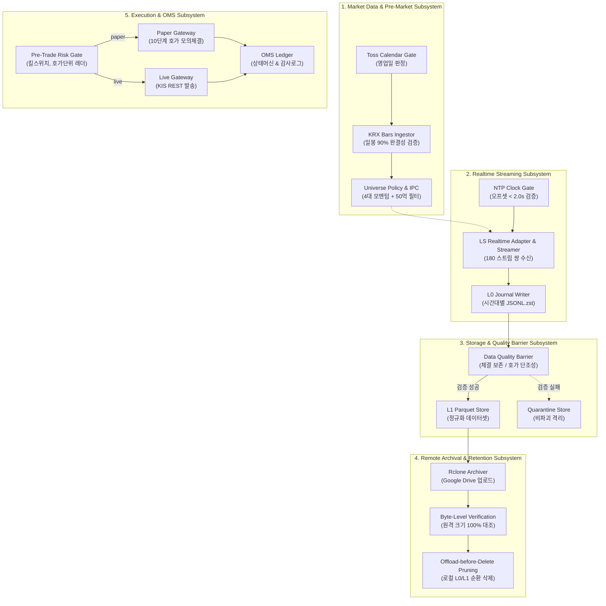

# Core Architecture Components

본 문서는 `krx-alpha` 저장소의 핵심 컴포넌트별 단일 책임(Single Responsibility), 입출력 계약, 의존 관계 및 장애 방어 불변식을 5대 서브시스템 단위로 정의합니다.

---

## 1. Subsystem Topology & Layer Interactions

---

## 2. Market Data & Pre-Market Subsystem

| 컴포넌트 | 핵심 책임 | 핵심 인터페이스 (Input / Output) | 장애 방어 및 불변식 (Fail-Closed) |
| :--- | :--- | :--- | :--- |
| **`Config & Paths`** | • 환경설정 및 불변 파일 경로(`DataPaths`) 관리 • 슬롯 예산 및 Live 무장 검증 | **In**: 환경변수 (`KRX_ALPHA_*`) **Out**: 불변 설정 인스턴스, 정규화된 `Path` | • **경로 단일 진실천(SSOT)**: 설정 외 파일시스템 리터럴 접근 0건 • **Live Armed 가드**: `KRX_ALPHA_EXEC_LIVE_ARMED=true` 누락 시 인스턴스화 차단 |
| **`TossCalendarGate`** | • 토스증권 캘린더 조회로 한국 시장 영업일 판정 | **In**: 기준 일자 (`dt.date`) **Out**: `TradingDay` 메타데이터 | • **영업일 게이트**: 휴장일 시 당일 스트리머 세션 오기동 선제 차단 |
| **`KrxBarsIngestor`** | • KRX 공식 일봉 수집 및 증분 적재 • 장애 시 KIS REST 1회 폴백 | **In**: 거래 일자, API 인증키 **Out**: `data/bars/daily.parquet` upsert | • **90% 행수 절단 가드**: 직전 거래일 대비 90% 미만 수집 시 `ImplausibleRowCountError` 발생 |
| **`UniversePolicy & IPC`** | • 롤링 20일 거래대금 및 60일 최고가 계산 • 4대 모멘텀 + 50억 유동성 필터로 최대 90종목 선정 | **In**: 일봉 패널, 결정 일자 **Out**: `data/candidates.json` (원자적 교체) | • **Look-Ahead 차단**: $T-1$ 거래일 종가만 참조, 미래 데이터 유입 시 `ValueError` • **슬롯 예산 하드캡**: 최대 90종목 강제 (`SlotBudgetExceededError`) |

---

## 3. Realtime Streaming Subsystem

| 컴포넌트 | 핵심 책임 | 핵심 인터페이스 (Input / Output) | 장애 방어 및 불변식 (Fail-Closed) |
| :--- | :--- | :--- | :--- |
| **`NtpClockGate`** | • 외부 타임서버(`kr.pool.ntp.org`)와 로컬 시계 오프셋 실측 | **In**: NTP 호스트명, 샘플 수 **Out**: 클럭 오프셋 나노초 (`int`) | • **2초 초과 드리프트 차단**: 오차 2초 초과 또는 통신 불가 시 `ClockUnsyncedError` 즉시 중단 |
| **`LsRealtimeAdapter`** | • LS증권 OAuth2 인증 및 WebSocket 연결 • 180 스트림 쌍 프레임 분류 및 지연 ACK 큐 | **In**: 웹소켓 실시간 텍스트 프레임 **Out**: 정규화된 `L0Frame` DTO | • **프레임 유실 방지**: `_pending` 큐로 연결 재설정 시에도 프레임 보존 • **단조 시퀀스**: `(conn_id, conn_seq)` 복합 식별자 부여 |
| **`RealtimeStreamer`** | • 비동기 이벤트 루프 수신 펌프 • 200건 단위 또는 타임아웃 시 L0 저널 플러시 | **In**: 어댑터 프레임 스트림 **Out**: L0 디스크 영속화 | • **안전 종료 보장**: `asyncio.FIRST_COMPLETED` 기반으로 SIGTERM 수신 시 버퍼 전량 플러시 |

---

## 4. Storage & Quality Barrier Subsystem

| 컴포넌트 | 핵심 책임 | 핵심 인터페이스 (Input / Output) | 장애 방어 및 불변식 (Fail-Closed) |
| :--- | :--- | :--- | :--- |
| **`L0JournalWriter`** | • 장중 원문 그대로 시간대별 압축 JSONL 적재 | **In**: `L0Frame` DTO **Out**: `data/l0/.../HH.jsonl.zst` | • **Append-Only 불변성**: 장중 파싱 배제로 이벤트 루프 블로킹 0% 보장 |
| **`DataQualityBarrier`** | • EOD 배치 정규화 및 틱/호가 정합성 검증 • 정상 파티션 L1 Parquet 변환 | **In**: L0 JSONL.zst 파일들 **Out**: `data/l1/.../*.parquet` | • **누적체결량 보존법칙**: 틱 손실 및 역행 검출 • **호가 사다리 단조성**: 매수/매도 10단계 역전 및 음수 잔량 검출 • **비파괴 격리**: 검증 실패 파티션은 삭제하지 않고 `quarantine/`으로 이동 |
| **`RcloneArchiver & Retention`** | • L1 Parquet Google Drive 백업 • 바이트 대사 후 로컬 L0/L1 순환 Prune | **In**: 로컬 L1 트리 **Out**: 원격 백업 및 로컬 디스크 회수 | • **Offload-before-Delete**: `rclone lsjson`으로 바이트 단위 일치 확인 시에만 로컬 삭제 • **디스크 워터마크**: 잔여 용량 3.0GB 미만 시 `StorageExhaustedError` |

---

## 5. Execution & OMS Subsystem

| 컴포넌트 | 핵심 책임 | 핵심 인터페이스 (Input / Output) | 장애 방어 및 불변식 (Fail-Closed) |
| :--- | :--- | :--- | :--- |
| **`PreTradeRiskGate`** | • 주문 전송 전 킬스위치, 호가단위, 한도 검증 | **In**: `OrderIntent` **Out**: 검증 통과 여부 | • **KRX 호가단위 래더**: 유효 호가단위 불일치 시 거부 • **1회/누적 손실한도**: 한도 초과 시 킬스위치 즉시 발동 |
| **`PaperGateway`** | • 실계좌 잔고 조회 + 10단계 호가 모의체결 • 전송 전문 저널링 (`paper_would_send`) | **In**: 검증 통과 주문 **Out**: 가상 체결 결과, 저널 아티팩트 | • **주문 누출 0%**: 실전 거래소 네트워크 소켓 연결 원천 배제 • **10호가 잔량 소진**: 실시간 호가 깊이를 반영한 현실적 체결 모델 |
| **`LiveGateway`** | • 한국투자증권 실계좌 OpenAPI REST 주문 전송 | **In**: 검증 통과 주문 **Out**: 브로커 주문 접수 응답 | • **이중 무장 확인**: `KRX_ALPHA_EXEC_LIVE_ARMED=true` 미충족 시 전송 거부 |
| **`OMSLedger`** | • 주문 상태머신 및 실행 원장 영속화 | **In**: 체결 보고, 취소 응답 **Out**: 확정 주문 상태, 트랜잭션 로그 | • **결정론적 상태 전이**: 브로커 누적 체결 수량 기반으로 불법 전이(`IllegalTransitionError`) 방어 |
