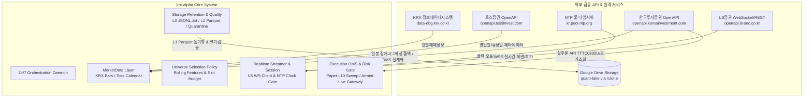
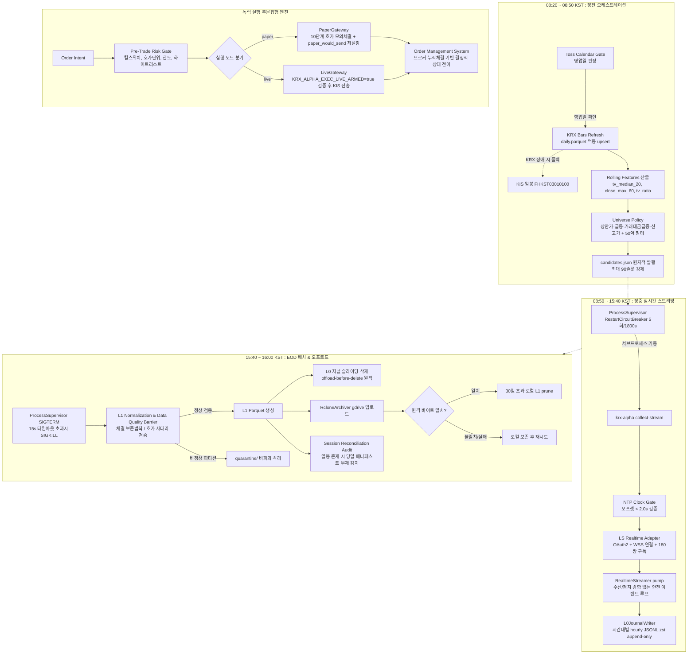
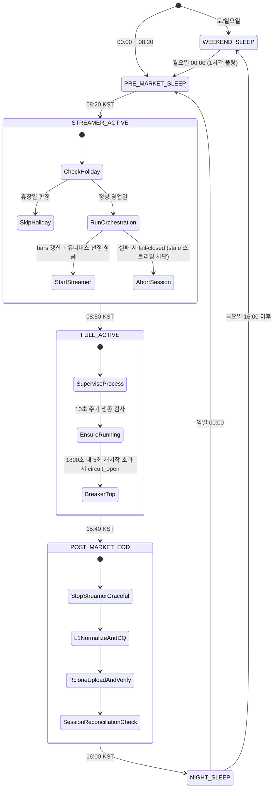

# System Architecture Overview

`krx-alpha`는 한국 거래소(KRX KOSPI/KOSDAQ) 시장을 대상으로 고빈도 틱(실시간 체결 및 10단계 호가) 데이터를 24/7 무인 자동 수집·정규화·원격 백업하고, 실계좌 섀도 검증 기반의 주문집행(OMS)을 제공하는 퀀트 트레이딩 인프라입니다.

자원 제한이 있는 클라우드 VPS(RAM 500MB, 슬라이딩 디스크 3GB 워터마크) 환경에서 장기간 무인 안정 구동을 달성하기 위해, 결정론적 계층화(Layered Architecture), 3계층 데이터 무결성 배리어, 엄격한 Fail-Closed 예외 제어, 단일 설정 소스 원칙을 적용하고 있습니다.

---

## 1. System Goals & Non-Goals

### Goals
1. **무손실 고빈도 틱 수집**: 리테일 브로커(LS증권) WebSocket 한도 내에서 일일 단타 유니버스(최대 90종목, 180 스트림 쌍)의 실시간 체결(`H0STCNT0`) 및 10단계 호가(`H0STASP0`)를 원형 손실 없이 L0 저널(JSONL.zst)에 append-only로 수집.
2. **사후 정합성 배리어 & 원격 이중화**: EOD(장마감) 배치 단계에서 틱 보존법칙, 호가 사다리 단조성, 시계열 역행 검증을 수행하고 L1 Parquet로 변환한 뒤, Google Drive(rclone) 영구 이중화 및 바이트 검증을 거쳐 로컬 스토리지를 자율 순환(offload-before-delete).
3. **안전한 실계좌 섀도 주문집행**: KIS(한국투자증권) 실계좌 OpenAPI와 연동하되, 실전 전송(Live) 전 단계에서 실제 10단계 호가 잔량을 소진하는 모의체결(`paper_l10_sweep_v1`)과 실전 직전 바디 직렬화 저널링(`paper_would_send`)을 통해 주문 누출 위험 0% 보장.
4. **결정론적 아키텍처 불변식 보장**: 코드베이스 내 순환 의존 0건, 상위 레이어 역참조 0건, `src/core/config.py` 외부 파일시스템 경로 리터럴 및 환경변수 접근 0건을 pytest AST 파싱으로 자동 검증.

### Non-Goals
* **전종목 실시간 틱 수집**: 국내 주식 전종목(2,500+)의 실시간 틱/호가 동시 수집은 증권사 리테일 API 한도(LS 100종목/200쌍, KIS 41쌍)상 불가능하므로, 당일 모멘텀/유동성 기반 유니버스 90종목으로 범위를 한정합니다.
* **장중 동적 종목 교체**: 장중 웹소켓 구독의 동적 변경에 따른 프레임 유실 및 재구독 경합을 방지하기 위해, 당일 구독 유니버스는 08:20 장전 일봉 기반으로 확정합니다.
* **프로덕션 틱 레벨 백테스터 구현**: 본 저장소는 수집 파이프라인, 정규화 엔진, OMS 코어에 집중하며, 대규모 시뮬레이션 백테스터는 L1 Parquet 산출물을 소비하는 별도 엔진의 책임으로 분리합니다.

---

## 2. System Boundary & External Dependencies



| 외부 의존처 | 프로토콜 | 역할 | 장애 격리 정책 |
| :--- | :--- | :--- | :--- |
| **KRX OpenData** | HTTPS REST | 일별 시장 매매정보(KOSPI/KOSDAQ) 수집 | 실패 시 KIS 일봉 폴백 시도, 미복구 시 기존 store로 진행 |
| **토스증권 OpenAPI** | HTTPS REST | 거래일 캘린더(`/market-calendar/KR`) 메타데이터 조회 | 인증/네트워크 장애 시 None으로 안전 열화(Soft Degradation) |
| **LS증권 OpenAPI** | WSS / HTTPS | 실시간 체결(`H0STCNT0`), 10단계 호가(`H0STASP0`) 스트리밍 | 프레임 재분류기 + 지연 ACK 큐, 서킷브레이커 기반 재기동 |
| **한국투자증권 OpenAPI** | HTTPS REST | 일봉 수집 폴백(`FHKST03010100`), 실계좌 잔고 조회, 주문집행 | Shared Token Bucket(18 req/s) 레이트리미터, 0600 토큰 원자 파일 캐시 |
| **NTP 타임서버** | NTP (UDP 123) | 세션 부트스트랩 시 로컬 클럭 드리프트 측정 | 오프셋 2초 초과 또는 미응답 시 `ClockUnsyncedError` Fail-Closed |
| **Google Drive** | rclone CLI | 정규화된 L1 Parquet 데이터 영구 오프로드 | 업로드 후 `rclone lsjson` 바이트 크기 일치 확인 전까지 로컬 파일 보존 |

---

## 3. High-Level Process Topology

시스템은 크게 **배치 수집 및 유니버스 선정**, **실시간 웹소켓 펌프**, **EOD 유지보수 및 오프로드**, **독립 실행 주문집행(OMS)**의 4대 파이프라인으로 구성됩니다.



---

## 4. 24/7 Daemon Lifecycle State Machine

`src/orchestration/daemon.py`는 `src/core/calendar.py`의 `SessionSchedule` 단일 소스를 공유하며 다음 6개 상태를 KST 기준으로 순환 전이합니다.



---

## 5. Architectural Layer Contracts (0 to 7)

본 저장소의 모든 모듈은 엄격한 계층 랭크(`LAYER_RANK`)를 부여받으며, 하위 레이어는 상위 레이어를 임포트할 수 없습니다 (`tests/architecture/test_layering.py`에 의해 강제).

```text
Layer 7: CLI Entrypoints (bars_refresh, collect_init, collect_status, collect_stream, universe_plan, order, main)
   ↓
Layer 6: System Orchestration & Execution Service (daemon.py, execution/service.py)
   ↓
Layer 5: Supervision & Core Workflow Engines (supervisor.py, eod.py, execution/oms.py)
   ↓
Layer 4: Domain Use Case Services & Gateways (marketdata/service.py, universe/service.py, realtime/session.py, realtime/streamer.py, execution/gateways.py)
   ↓
Layer 3: Vendor Raw Clients & Adapters (realtime/adapters/ls.py, execution/kis_client.py)
   ↓
Layer 2: Storage Persistence, Quality Barriers & Invariants (storage/journal.py, retention.py, remote.py, quality.py, universe/ipc.py, realtime/manifest.py, execution/risk.py, ledger.py, journal.py)
   ↓
Layer 1: Domain Contracts, Rules, Clock & Tick Definitions (marketdata/krx_bars.py, toss_calendar.py, universe/policy.py, realtime/contracts.py, subscription.py, clock.py, execution/contracts.py, ticks.py)
   ↓
Layer 0: Core Foundation & Schemas (core/config.py, core/calendar.py, core/errors.py, marketdata/schema.py)
```

### Invariant Enforcements
1. **Zero Upward Layer Dependency**: AST 분석을 통해 상위 레이어로의 직접 임포트 및 함수 내 지연 임포트 전면 차단.
2. **Zero Hardcoded Paths**: `src/core/config.py`의 `DataPaths` 외 어떤 모듈에서도 `Path("...")` 리터럴 생성 금지.
3. **Zero Direct Environment Access**: `os.environ` 및 `os.getenv`는 오직 `src/core/config.py`의 Pydantic Settings 클래스 내부에서만 호출 가능.

---

## 6. Related Architecture Documentation

* **데이터 흐름 및 스키마 상세:** [`docs/architecture/data-flow.md`](data-flow.md)
* **서브시스템별 핵심 컴포넌트:** [`docs/architecture/components.md`](components.md)
* **아키텍처 결정 기록 (ADR):** [`docs/architecture/design-decisions.md`](design-decisions.md)
* **멀티 브로커 OpenAPI 역설계 명세:** [`docs/architecture/brokers/api_master.md`](brokers/api_master.md)

