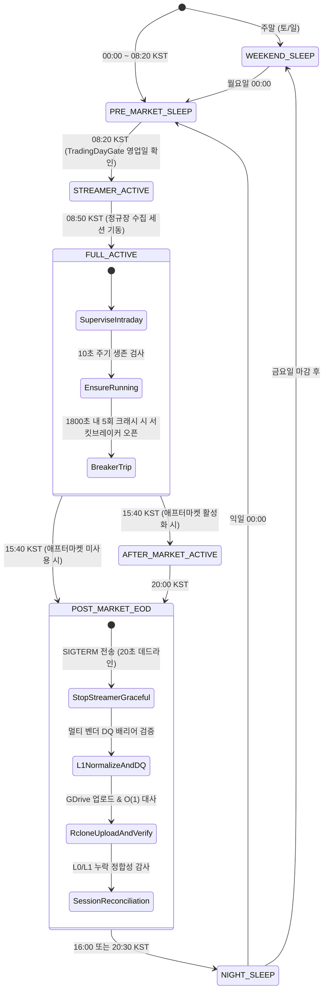
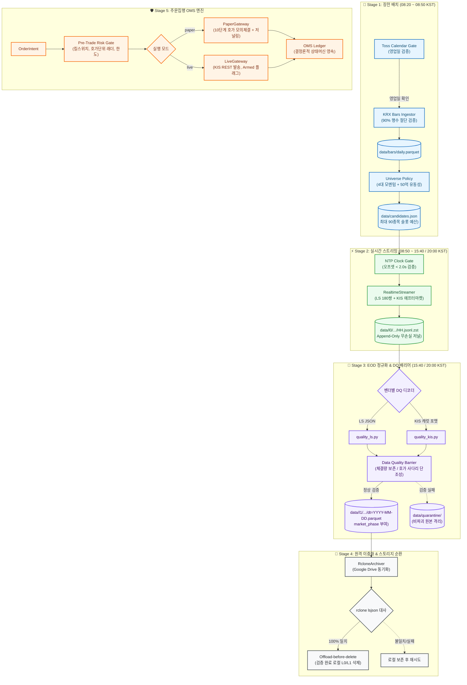

# System Architecture & Design Specification

`krx-alpha`는 한국 거래소(KRX KOSPI/KOSDAQ) 시장을 대상으로 고빈도 틱(실시간 체결 및 10단계 호가) 데이터를 24/7 무인 자동 수집·정규화·원격 백업하고, 실계좌 섀도 검증 기반의 주문집행(OMS)을 제공하는 퀀트 트레이딩 인프라입니다.

제한된 자원의 클라우드 VPS(RAM 500MB, 슬라이딩 디스크 3GB 워터마크) 환경에서 장기간 무인 안정 구동을 달성하기 위해, 결정론적 계층화(Layered Architecture), 3계층 데이터 무결성 배리어, 엄격한 Fail-Closed 예외 제어, 단일 설정 소스 원칙을 적용합니다.

---

## 1. System Goals & Invariant Principles

### System Goals
1. **무손실 고빈도 틱 수집**: 리테일 브로커(LS증권) WebSocket 한도 내에서 일일 단타 유니버스(최대 90종목, 180 스트림 쌍)의 실시간 체결(`H0STCNT0`) 및 10단계 호가(`H0STASP0`)를 원형 손실 없이 L0 저널(JSONL.zst)에 append-only로 수집.
2. **사후 정합성 배리어 & 원격 이중화**: EOD(장마감) 배치 단계에서 틱 보존법칙, 호가 사다리 단조성, 시계열 역행 검증을 수행하고 L1 Parquet로 변환한 뒤, Google Drive(rclone) 영구 이중화 및 바이트 대사를 거쳐 로컬 스토리지를 자율 순환(offload-before-delete).
3. **안전한 실계좌 섀도 주문집행**: KIS(한국투자증권) 실계좌 OpenAPI와 연동하되, 실전 전송(Live) 전 단계에서 실제 10단계 호가 잔량을 소진하는 모의체결(`paper_l10_sweep_v1`)과 실전 직전 바디 직렬화 저널링(`paper_would_send`)을 통해 주문 누출 위험 0% 보장.
4. **결정론적 아키텍처 불변식 보장**: 코드베이스 내 순환 의존 0건, 상위 레이어 역참조 0건, `src/core/config.py` 외부 파일시스템 경로 리터럴 및 환경변수 접근 0건을 pytest AST 파싱으로 기계적 강제.

### Non-Goals (시스템 경계 한정)
* **전종목 실시간 틱 수집**: 국내 주식 전종목(2,500+)의 동시 수집은 증권사 웹소켓 세션 한도(LS 100종목/200쌍, KIS 41쌍)상 불가능하므로, 당일 모멘텀/유동성 90종목으로 한정합니다.
* **장중 동적 종목 교체**: 웹소켓 재구독 경합 및 프레임 유실을 방지하기 위해 당일 유니버스는 08:20에 확정 후 장 마감까지 고정합니다.
* **프로덕션 백테스터 엔진 구현**: 본 인프라는 무손실 수집 파이프라인과 OMS 코어에 집중하며, 백테스터는 산출된 L1 Parquet를 소비하는 독립 계층으로 분리합니다.

---

## 2. Multi-Vendor System Boundary

```mermaid
flowchart TB
    subgraph Vendors [외부 금융 API & 원격 인프라]
        KRX[KRX 정보데이터시스템<br/>일별매매정보 REST]
        TOSS[토스증권 OpenAPI<br/>영업일 캘린더 / 프로그램매매]
        LS[LS증권 WebSocket<br/>정규장 틱/호가 스트리밍]
        KIS[한국투자증권 OpenAPI<br/>일봉 폴백 / 애프터마켓 WS / 실계좌 OMS]
        NTP[NTP 풀 타임서버<br/>kr.pool.ntp.org]
        GDRIVE[(Google Drive Storage<br/>rclone remote)]
    end

    subgraph KRX_Alpha [krx-alpha Core Pipeline]
        Daemon[24/7 Orchestration Daemon<br/>PID 1 Graceful Shutdown & Deploy Gate]
        MarketData[MarketData Layer<br/>KRX Bars / Toss Calendar Gate / Snapshot]
        Universe[Universe Policy & IPC<br/>Momentum 4-Factor + 50억 유동성 필터]
        Realtime[Realtime Streamer<br/>NTP Clock Gate & Multi-Vendor Adapters]
        Storage[Storage & Quality Barrier<br/>L0 JSONL.zst / Multi-Vendor DQ / L1 Parquet]
        Execution[Execution OMS Engine<br/>Risk Gate / Paper Sweep / Armed Live]
    end

    KRX -->|일별 매매데이터| MarketData
    TOSS -->|영업일 캘린더 판정| MarketData
    KIS -.->|일봉 장애시 1회 폴백| MarketData
    KIS -->|애프터마켓 WS 스트림| Realtime
    LS -->|정규장 180쌍 WS 스트림| Realtime
    NTP -->|클럭 오프셋 ns 실측| Realtime
    Storage -->|L1 Parquet 동기화 & 크기 대사| GDRIVE
    KIS <-->|실계좌 잔고 조회 & 주문 전송| Execution
```



| 외부 의존처 | 프로토콜 | 역할 | 장애 격리 및 안전 정책 |
| :--- | :--- | :--- | :--- |
| **KRX OpenData** | HTTPS REST | 정규장 일별 매매정보 수집 | 90% 미만 행수 절단 시 거부, KIS 일봉 1회 폴백 |
| **토스증권 OpenAPI** | HTTPS REST | 거래일 캘린더 판정 & 프로그램매매 백필 | 통신 장애 시 None으로 소프트 열화(Soft Degradation) |
| **LS증권 OpenAPI** | WSS / HTTPS | 정규장 체결(`H0STCNT0`), 10호가(`H0STASP0`) 스트리밍 | 프레임 분류기 + 지연 ACK 큐, 서킷브레이커(5회/1800s) |
| **한국투자증권 OpenAPI** | WSS / HTTPS | 애프터마켓 틱 수집, 일봉 폴백, 실계좌 OMS | 토큰 공유 락 자가복구, 41쌍 샤딩, Live 무장 가드 |
| **NTP 타임서버** | UDP 123 | 세션 기동 시 시스템 클럭 오프셋 실측 | 2.0초 초과 또는 통신 불가 시 `ClockUnsyncedError` 즉시 거부 |
| **Google Drive** | rclone CLI | 정규화된 L1 Parquet 영구 오프로드 | `rclone lsjson` 접두사 대사 100% 일치 시에만 로컬 L0/L1 삭제 |

---

## 3. 24/7 Daemon Lifecycle & Session State Machine

데몬(`src/orchestration/daemon.py`)은 캘린더 모듈(`src/core/calendar.py`)의 `SessionSchedule` 단일 진실천(SSOT)에 따라 KST 기준 상태를 순환 전이합니다.



### 무중단 운영을 위한 2대 오케스트레이션 가드
1. **장중 배포 유예 게이트 (`deploy_gate.py`)**:
   - 평일 08:10~22:00 KST 중 CI에 의한 컨테이너 재생성을 건너뛰어 실시간 틱 수집 공백을 0건으로 유지합니다.
   - 22:00 야간 슬롯의 호스트 타이머(`docker compose up -d`)가 누적 배포를 일괄 반영합니다.
2. **데몬 PID 1 SIGTERM 핸들러**:
   - 도커 컨테이너 루트 프로세스(PID 1)가 시그널을 무시하던 문제를 해결하여, SIGTERM 수신 시 모든 하위 수집기 프로세스에 20초 데드라인의 우아한 종료(Graceful Shutdown)를 전파하고 잔여 버퍼를 완결 플러시합니다.

---

## 4. End-to-End Pipeline & Data Flow



---

## 5. Storage Architecture & Microstructure Invariants

### 5.1 3-Tier Storage Schemas

#### L0 Raw Tick Frame (`L0Frame`)
실시간 웹소켓 수신 시 파싱 부하를 배제하고 무손실 원형을 보존합니다:
* `recv_mono_ns` (단조 시각 - 시스템 경과 ns, 지연 계측용), `recv_wall_ns` (절대 시각 - UTC ns, 시계열 정렬용), `conn_seq` (세션 단조 시퀀스), `conn_id` (연결 고유 식별자), `raw` (수신 원문 페이로드).

#### L1 Normalized Parquet (`data/l1/{vendor}/{stream}/dt=YYYY-MM-DD.parquet`)
EOD 단계에서 동일 `(conn_id, conn_seq)` 중복을 제거하고 정규화한 데이터셋입니다:

| 컬럼명 | Polars 타입 | 설명 및 무결성 제약 |
| :--- | :--- | :--- |
| `recv_mono_ns` | `pl.Int64` | 수신 단조 시각 타임스탬프 (레이턴시 계측용) |
| `recv_wall_ns` | `pl.Int64` | 수신 절대 시각 타임스탬프 (UTC 기준 시계열 정렬용) |
| `conn_seq` | `pl.Int64` | 세션별 단조 증가 시퀀스 번호 |
| `raw` | `pl.String` | 원본 페이로드 문자열 |
| `conn_id` | `pl.String` | 웹소켓 세션 식별자 |
| `vendor` | `pl.String` | 수집 벤더 (`"ls"`, `"kis"`) |
| `tr_id` | `pl.String` | 스트림 트랜잭션 식별자 |
| `exchange_event_time` | `pl.String` | 거래소 이벤트 시각 (`HHMMSS`, KST) |
| `market_phase` | `pl.String` | 거래소 이벤트 시각 기준 세션 구간 (아래 표 참조) |

### 5.2 Market Session Taxonomy (2026-09-14 제도 개편 반영)

| Venue | Canonical 세션 명칭 (KO) | 시간대 (KST) | 거래 체결 특성 |
| :--- | :--- | :--- | :--- |
| **KRX** | **장전 시간외종가** | `08:30 ~ 08:40` | 전일 종가 기준 단일가 |
| **KRX** | **시가 동시호가** | `08:30 ~ 09:00` | 단일가 호가 접수 |
| **KRX** | **정규장** | `09:00 ~ 15:20` | 접속매매 (Continuous) |
| **KRX** | **종가 동시호가** | `15:20 ~ 15:30` | 당일 종가 결정 단일가 |
| **KRX** | **장후 시간외종가** | `15:40 ~ 16:00` | 당일 종가(15:30) 기준 단일가 |
| **KRX** | **애프터마켓** | `16:00 ~ 20:00` | 접속매매 (Continuous) |
| **NXT** | **애프터마켓** | `15:40 ~ 20:00` | 대체거래소 접속매매 |

> **용어 불변식 규칙:** 위 표의 두 정규 종가 토큰(`장전 시간외종가`, `장후 시간외종가`) 이외의 모호한 레거시 세션 어휘(단독 사용)는 저장소 전역 AST 검증(`test_terminology.py`)으로 금지되며, 영문 표기는 반드시 `aftermarket`으로 통일합니다.

### 5.3 Microstructure Quality Barrier (금융 무결성 배리어)

1. **체결량 보존법칙 (틱 누락 검출, Tick Loss Detection)**:
   누적체결건수 델타 $\Delta checnt \le 1$ 구간에서 누적 거래량 증가량($\Delta volume$)이 당일 틱 체결량($cvolume$)을 초과하는 틱 누락 발생 여부를 Polars 벡터 연산으로 검사.
2. **호가 사다리 단조성 (호가 순차 정렬 검증, Ladder Monotonicity)**:
   - 매도 10단계: $offerho_1 < offerho_2 < \dots < offerho_{10}$ (오름차순 정렬)
   - 매수 10단계: $bidho_1 > bidho_2 > \dots > bidho_{10}$ (내림차순 정렬)
   - 잔량 음수($rem < 0$) 및 동시호가 외 최우선 호가 역전(Crossed Market, $bidho_1 \ge offerho_1$) 검출.
3. **다중 벤더 디코더 격리**:
   LS증권의 JSON 포맷 디코더(`quality_ls.py`)와 KIS의 캐럿(`^`) 텍스트 포맷 디코더(`quality_kis.py`)를 완전히 분리하여 상호 오염 및 디코딩 오탐을 방지.

---

## 6. Architectural Layer Contracts (Layer 0 to 7)

시스템은 8계층(`LAYER_RANK`)으로 엄격히 위계화되어 있으며, 상위 레이어 역참조는 CI 단계에서 정적으로 차단됩니다.

```text
Layer 7: CLI Entrypoints (collect_*, bars_refresh, universe_plan, order, main)
   ↓
Layer 6: System Orchestration & Execution Service (daemon, execution service)
   ↓
Layer 5: Supervision & Core Workflow Engines (supervisor, eod, execution/oms, deploy/trading-day gates)
   ↓
Layer 4: Domain Use Case Services & Gateways (marketdata/universe service, session/streamer, execution gateways)
   ↓
Layer 3: Vendor Raw Clients & Adapters (LS 어댑터, KIS 클라이언트, normalize worker)
   ↓
Layer 2: Storage Persistence, Quality Barriers & Invariants (journal, normalization, quality, retention, remote, risk, ledger)
   ↓
Layer 1: Domain Contracts, Rules, Clock & Tick Definitions (bars, calendar, universe policy, realtime contracts, execution contracts)
   ↓
Layer 0: Core Foundation & Schemas (config, calendar, errors, symbols, paths, observability)
```

### 3대 정적 아키텍처 불변식 (Pytest AST Enforced)
1. **Zero Upward Layer Dependency**: 하위 레이어가 상위 레이어를 임포트하는 것(지연 임포트 포함)을 0건으로 강제.
2. **Zero Hardcoded Paths**: `src/core/config.py`의 `DataPaths` 외의 모든 모듈에서 `Path("...")` 문자열 리터럴 직접 생성 금지.
3. **Zero Direct Environment Access**: `os.environ` 및 `os.getenv`는 오직 `src/core/config.py`의 Pydantic 모델 내부에서만 호출 허용.

---

## 7. Related Documentation

* **[Architectural Decision Records (ADRs)](engineering-decisions.md)**: 8대 핵심 설계 결정 및 트레이드오프 분석.
* **[Multi-Broker OpenAPI Specifications](brokers/api_master.md)**: KIS, LS, 키움, 토스 4대 증권사 API 스펙 및 한도 매트릭스.
* **[Generated Code Map](../code_map.json)**: 전체 `src/` 모듈의 레이어 랭크, 내부 의존성 간선, 연계 테스트 매핑 탐색 지도.

