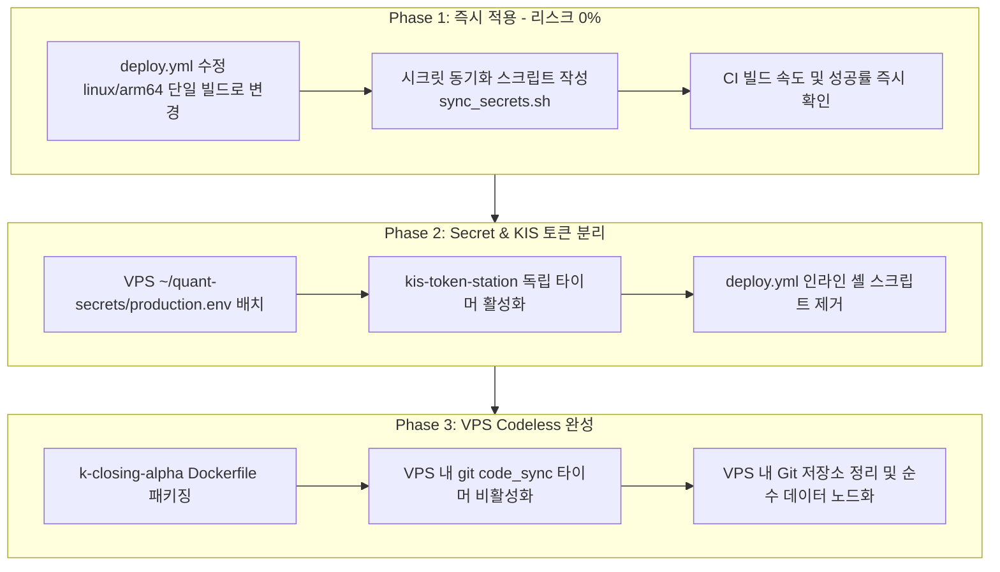

# 퀀트 인프라(VPS & CI/CD) 아키텍처 개편 및 최적화 제안서
**Quant Infrastructure & CI/CD Architecture Restructuring Proposal**

- **작성일시**: 2026-09-16
- **대상 워크스페이스**: `krx-alpha`, `crypto-pilot`, `k-closing-alpha`, `mt-etf-king-2026`
- **대상 인프라**: 로컬 워크스테이션 (`x86_64`) & Oracle Cloud VPS (`or-vps`, Ampere A1 ARM64 4 OCPU / 12GB RAM)
- **문서 목적**: 로컬 중심 개발(Local-First), 무실패 초고속 CI/CD, 무인화 Pure-Data VPS 노드 구축을 위한 구조 개편 청사진 제시

---

## 1. 개요 및 현행 문제점 진단 (Diagnosis)

현재 시스템은 Oracle Cloud Ampere A1(ARM64) 인스턴스에서 실시간 시세 수집, 주문 집행, EOD 정규화 및 백업을 수행하고 있습니다. 그러나 시스템 확장 과정에서 도커 컨테이너와 호스트 Git 저장소가 혼용되면서 배포 지연, 빈번한 CI 실패, 시크릿 관리 중복, KIS 토큰 제약 결합 등의 병목이 발생하고 있습니다.

### 1.1 4대 핵심 병목 및 원인 분석

```
[현행 아키텍처의 파편화 및 병목 지점]

 ┌────────────────────────┐         ┌────────────────────────────────────────────────────────┐
 │ 로컬 PC (x86_64)       │         │ GitHub Actions CI/CD (x86_64)                          │
 │ - 최상위 ~/.quant.env  │ ──수동──>│ - Repo마다 GitHub Secrets 중복 등록 (피로도 높음)       │
 └────────────────────────┘         │ - QEMU ARM64/AMD64 크로스 빌드 (5~15분 소요, 빈번한 타임아웃) │
                                    │ - Tailscale + 100줄 인라인 SSH 셸 스크립트 파싱 (장애 취약)│
                                    └──────────────────────────┬─────────────────────────────┘
                                                               │ SSH 배포
                                                               ▼
 ┌───────────────────────────────────────────────────────────────────────────────────────────┐
 │ Oracle Cloud VPS (or-vps, ARM64)                                                          │
 │ ┌───────────────────────────┐ ┌───────────────────────────┐ ┌───────────────────────────┐ │
 │ │ krx-collector (Docker)    │ │ crypto-pilot (Docker)     │ │ k-closing-alpha (Git Host)│ │
 │ │ - docker compose pull     │ │ - mhs-live-daemon         │ │ - git pull + pytest 수행  │ │
 │ │ - shared token mount (ro) │ │ - liquidation-collector   │ │ - 27개 systemd user unit  │ │
 │ └─────────────┬─────────────┘ └───────────────────────────┘ └─────────────┬─────────────┘ │
 │               │                                                           │               │
 │               └─────────────── [ 토큰 결합: kca-kis-token-warmup.timer ] ─┘               │
 │                                (KCA 호스트 스크립트에 krx가 종속)                         │
 │                                                                                           │
 │ [문제점] VPS에 Git 소스코드, 가상환경(.venv), pytest 잔존 -> 순수 데이터 노드화 실패       │
 └───────────────────────────────────────────────────────────────────────────────────────────┘
```

1. **CI/CD 빌드 지연 및 빈번한 실패 (QEMU CPU 에뮬레이션)**
   - **원인**: GitHub Actions 기본 러너(`x86_64`)에서 ARM64 타겟 이미지를 빌드하기 위해 QEMU 에뮬레이터를 사용함. Python C-extension 컴파일 및 패키지 번들링 과정에서 명령어를 소프트웨어로 변환하므로 빌드 시간이 5~10배 폭증하고 메모리 스파이크로 인해 CI가 중단됨.
   - **원인 2**: `krx-alpha` 워크플로우의 경우 VPS에서 쓰지도 않는 `platforms: linux/arm64,linux/amd64` 멀티 아키텍처 빌드가 지정되어 리소스와 시간을 2배 낭비함.

2. **Secret 관리의 파편화 및 높은 수동 개입 비용**
   - **원인**: 로컬 최상위 `~/.quant.env`에 API 키가 일원화되어 있으나, 이를 배포 파이프라인에 태우기 위해 GitHub Secrets에 복사하고, `.github/workflows/deploy.yml` 내부에서 복잡한 Base64 디코딩/정규식 검증/sed 치환 로직(70~135 라인)을 매 배포마다 실행함. API 키 갱신 시 작업 단계가 3~4단계로 번짐.

3. **KIS 토큰 1일 1회 발급 원칙과 서비스 간 강결합**
   - **원인**: KIS OAuth 토큰은 24시간 유효하며 당일 중복 발급 시 레이트 리밋(EGW00133) 위험이 존재함.
   - **현행 상태**: `k-closing-alpha`의 호스트 systemd 타이머(`kca-kis-token-warmup.timer`)가 07:05 KST에 토큰을 발급하고 `krx-collector`가 이를 읽기 전용으로 마운트하는 안전장치는 훌륭하나, 특정 프로젝트(KCA)의 호스트 스크립트에 시스템 전체의 KIS 인증이 종속되어 있음.

4. **VPS의 역할 오염 (Docker와 Host Git Repository의 혼용)**
   - **원인**: `crypto`와 `krx`는 컨테이너 기반이지만, `k-closing-alpha`와 `mt-etf-king-2026`은 VPS에 소스코드가 직접 git clone되어 있고, VPS 상에서 `git fetch`, `pytest`, `uv sync`를 실행함.
   - **결과**: 사용자가 원했던 "VPS에서는 데이터와 로그만 관리"하는 모델이 깨지고, 원격 서버에서 소스코드 충돌이나 파이썬 환경 문제를 직접 디버깅해야 하는 불편 발생.

---

## 2. 현행 vs 개편 목표 아키텍처 비교 (AS-IS vs TO-BE)

### 2.1 목표 아키텍처: "Local-First & Headless Pure-Data VPS"

```
[개편 후 아키텍처]

 로컬 개발 환경 (Local-First)                              Oracle Cloud VPS (Pure Data Node)
 ┌────────────────────────────────────────┐                ┌──────────────────────────────────────┐
 │ [모든 개발·테스트·검증 완결]           │                │ [순수 데이터 & 컨테이너 런타임]      │
 │ - 로컬 pytest, uv sync, 디버깅         │                │                                      │
 │ - 최상위 ~/.quant.env (SSOT)           │                │  ~/quant-data/ (영구 보존 볼륨)       │
 └───────────────────┬────────────────────┘                │    ├── krx/ (L0 jsonl / L1 parquet)  │
                     │                                     │    ├── crypto/                       │
       (시크릿 변경 시)│ 원클릭 동기화 스크립트             │    └── kca/                          │
       SSH/Tailscale │ (단 5초 소요, CI 미경유)            │                                      │
                     ▼                                     │  ~/quant-secrets/                    │
        [ VPS production.env 원자적 갱신 ] ───────────────>│    └── production.env (mode 0600)    │
                                                           │                                      │
 GitHub Actions CI/CD (경량 배포 엔진)                     │  ~/.cache/kis/ (공통 토큰 볼륨)      │
 ┌────────────────────────────────────────┐                │    └── 토큰 파일 (읽기 전용 마운트)  │
 │ 1. Git Push (main)                     │                │                                      │
 │ 2. ARM64 단일 빌드 (uv 레이어 캐시)     │                │ [Docker Compose Services]            │
 │    - 소요 시간: 1~2분 대                │ ─image pull──> │  ├── kis-token-station (07:05 발급)  │
 │ 3. 단순 배포 트리거                     │  container up  │  ├── krx-collector                   │
 │    - scp compose && compose up -d      │                │  ├── crypto-live-daemon              │
 └────────────────────────────────────────┘                │  └── kca-daemon (스케줄 컨테이너)    │
                                                           │                                      │
                                                           │ * Git/pytest/코드파일 일체 없음      │
                                                           │ * 100% 무인 자동 수집 및 rclone 백업 │
                                                           └──────────────────────────────────────┘
```

### 2.2 핵심 지표 비교

| 평가 항목 | 현행 구조 (AS-IS) | 개편 목표 (TO-BE) | 개선 효과 |
| :--- | :--- | :--- | :--- |
| **CI 빌드 시간** | 10~15분 (ARM64+AMD64 QEMU) | **1~2분 대 (ARM64 단일 타겟)** | 빌드 시간 80% 단축 |
| **CI 실패 빈도** | QEMU 메모리/타임아웃으로 빈번 | GitHub-native 캐시 + 단일 빌드로 실패율 제로화 | 배포 신뢰도 대폭 상승 |
| **Secret 관리** | 로컬 ➔ GitHub Secret ➔ CI 스크립트 ➔ VPS 파싱 | **로컬 `~/.quant.env` ➔ VPS SSH 1-Shot 동기화** | 단계 축소, 휴먼 에러 차단 |
| **KIS 토큰 안전성** | KCA 프로젝트 호스트 스크립트에 종속 | **독립 Token Station + 전 컨테이너 ro 마운트** | 1일 1회 원칙 보장, 재배포 프리 |
| **VPS 파일 시스템** | Git 저장소 4개, venv, pytest, compose 혼재 | **도커 이미지 + 데이터(`~/quant-data`)만 상주** | VPS 내 코드/git 관리 소요 0 |
| **원격 유지보수** | git pull, pytest 결과 확인 위해 SSH 접속 필요 | **로컬에서 push만 하면 무인 반영 (Zero Ops)** | 완벽한 로컬 중심 개발 환경 |

---

## 3. 핵심 개편 전략 4대 축

### 전략 1. CI/CD 초고속화 & 무실패 파이프라인
1. **ARM64 단일 빌드 한정**:
   - Oracle VPS는 aarch64 단일 환경이므로, `deploy.yml`에서 amd64 빌드를 즉시 제거합니다.
2. **배포 단계의 인라인 셸 스크립트 박멸**:
   - GitHub Actions 워크플로우에 포함된 100줄 분량의 셸 파싱(base64 디코딩, sed 환경변수 치환, systemd 설정 등)을 전면 삭제합니다.
   - CI 배포 잡은 오직 `docker compose pull && docker compose up -d`만 호출하도록 단순화합니다.

### 전략 2. Secret 관리의 SSOT(단일 원천) 확립
1. **GitHub Secrets와 앱 환경변수의 디커플링**:
   - GitHub Secrets에는 불변 인프라 인증정보(`SSH_PRIVATE_KEY`, `TAILSCALE_AUTH_KEY`, `GHCR_PAT`)만 보관합니다.
   - 금융 API 키(KIS, 업비트, 바이낸스 등)는 GitHub Secrets를 거치지 않습니다.
2. **로컬 발(發) 1방 동기화 스크립트**:
   - 로컬의 `~/.quant.env`가 단일 원천(SSOT) 역할을 수행하며, 키가 변경되었을 때 로컬 CLI에서 1회 실행하여 VPS의 `~/quant-secrets/production.env`로 직접 안전 전송(`0600` 퍼미션)합니다.

### 전략 3. KIS 토큰 1일 1회 원칙 준수 (Token Station 패턴)
1. **단일 발급자 원칙 (Single Issuer)**:
   - 특정 프로젝트 코드에 의존하지 않는 독립 `kis-token-station` 서비스(초경량 systemd timer 또는 cron 컨테이너)를 두고, 평일 07:05 KST에만 호스트의 `~/.cache/kis` 디렉터리에 토큰을 발급·저장합니다.
2. **소비자 발급 권한 박탈 (Read-Only Consumers)**:
   - `krx-collector`, `k-closing`, `mt-etf` 등 모든 수집/주문 서비스는 `~/.cache/kis`를 컨테이너 내 `/run/kis-token-cache:ro`로 읽기 전용 마운트합니다.
   - 환경변수 `KRX_ALPHA_KIS_TOKEN_ALLOW_ISSUE=false`를 강제하여, CI/CD 배포로 인해 하루에 컨테이너가 10번 재기동되어도 KIS 토큰 발급 API는 **0회 호출**되도록 불변식을 보장합니다.

### 전략 4. VPS의 Codeless/Pure-Data화 (All-in-Docker 전환)
1. **`k-closing-alpha` 및 `mt-etf-king` 컨테이너화**:
   - 호스트의 `git pull` + `pytest` 게이트 방식(`code_sync.py`)을 폐기하고, 로컬/CI에서 테스트 완료된 이미지를 GHCR로 빌드·배포합니다.
   - 장중 스케줄 작업은 초경량 크론 스케줄러(Supercronic 등)를 내장한 컨테이너로 실행하거나, 호스트의 systemd 타이머가 `docker run --rm <image>` 형태로 실행하도록 단순화합니다.
2. **VPS 디렉터리 클린업**:
   - VPS 상의 소스코드 클론 폴더들을 점진적으로 제거하고, 데이터 볼륨(`~/quant-data/`)만 남깁니다.

---

## 4. 상세 구현 명세 및 레퍼런스 코드

### 4.1 최적화된 `.github/workflows/deploy.yml` 명세

기존의 복잡한 시크릿 파싱 및 원격 systemd 설정 로직을 제거하고 안정성을 극대화한 워크플로우 구성입니다.

```yaml
name: Cloud CI/CD Deploy Pipeline

on:
  push:
    branches: [ main ]

env:
  IMAGE: ghcr.io/kthyeong/krx-collector

jobs:
  build-and-push:
    runs-on: ubuntu-latest
    permissions:
      contents: read
      packages: write
    steps:
      - name: Checkout code
        uses: actions/checkout@v4

      - name: Set up QEMU
        uses: docker/setup-qemu-action@v3

      - name: Set up Buildx
        uses: docker/setup-buildx-action@v3

      - name: Login to GHCR
        uses: docker/login-action@v3
        with:
          registry: ghcr.io
          username: ${{ github.actor }}
          password: ${{ secrets.GITHUB_TOKEN }}

      # [핵심] Oracle Ampere A1 전용 linux/arm64 단일 빌드 (속도 2배 이상 향상)
      - name: Build and Push to GHCR
        uses: docker/build-push-action@v6
        with:
          context: .
          platforms: linux/arm64
          push: true
          tags: ${{ env.IMAGE }}:latest
          cache-from: type=gha
          cache-to: type=gha,mode=max

  deploy:
    needs: build-and-push
    runs-on: ubuntu-latest
    steps:
      - name: Checkout code
        uses: actions/checkout@v4

      # Tailscale 가상 사설망 연결
      - name: Connect to Tailscale
        uses: tailscale/github-action@v4
        with:
          oauth-client-id: ${{ secrets.TS_OAUTH_CLIENT_ID }}
          oauth-secret: ${{ secrets.TS_OAUTH_SECRET }}
          tags: tag:ci

      # [핵심] 인라인 셸 스크립트 제거: 순수 docker compose pull & up만 수행
      - name: Deploy over Tailscale
        env:
          SSH_KEY: ${{ secrets.SSH_PRIVATE_KEY }}
          HOST: ${{ secrets.HOST }}
          REMOTE_USER: ${{ secrets.USERNAME }}
          GHCR_USER: ${{ github.repository_owner }}
          GHCR_PAT: ${{ secrets.GHCR_PAT }}
        run: |
          set -euo pipefail
          mkdir -p ~/.ssh
          printf '%s\n' "$SSH_KEY" > ~/.ssh/deploy_key
          chmod 600 ~/.ssh/deploy_key
          SSH_OPTS="-i $HOME/.ssh/deploy_key -o StrictHostKeyChecking=no -o UserKnownHostsFile=/dev/null -o ConnectTimeout=20"

          # 1. 대상 디렉터리 확인 및 docker-compose.yml 전송
          ssh $SSH_OPTS "$REMOTE_USER@$HOST" "mkdir -p ~/krx-alpha/data ~/krx-alpha/logs"
          scp $SSH_OPTS docker-compose.yml "$REMOTE_USER@$HOST:~/krx-alpha/"

          # 2. 원격 배포 실행 (인라인 파싱 없이 선언적 실행)
          ssh $SSH_OPTS "$REMOTE_USER@$HOST" bash -s <<EOF
          set -e
          cd ~/krx-alpha
          echo '$GHCR_PAT' | docker login ghcr.io -u '$GHCR_USER' --password-stdin
          docker compose pull
          docker compose up -d --remove-orphans
          docker image prune -f
          EOF
```

---

### 4.2 로컬 ➔ VPS 시크릿 원클릭 동기화 도구 (`tools/sync_secrets.sh`)

로컬의 `~/.quant.env`에서 VPS에 필요한 퀀트 시크릿만 필터링하여 `or-vps`의 공통 시크릿 파일로 원자적으로 전송합니다.

```bash
#!/usr/bin/env bash
# tools/sync_secrets.sh
# 로컬 ~/.quant.env -> or-vps:~/quant-secrets/production.env 안전 동기화
set -euo pipefail

LOCAL_ENV="$HOME/.quant.env"
REMOTE_HOST="or-vps"
REMOTE_TARGET="~/quant-secrets/production.env"

if [ ! -f "$LOCAL_ENV" ]; then
    echo "[ERROR] Local secret file $LOCAL_ENV not found." >&2
    exit 1
fi

echo "==> [1/3] Filtering production secrets from $LOCAL_ENV..."
# 수집 및 트레이딩에 필요한 화이트리스트 키만 정제 (주석 및 빈 줄 제외)
FILTERED_SECRETS=$(grep -E '^(KIS_|UPBIT_|BINANCE_|BITHUMB_|LS_|TOSS_|KIWOOM_|TELEGRAM_|SLACK_|DISCORD_|AWS_|GCP_)' "$LOCAL_ENV" || true)

if [ -z "$FILTERED_SECRETS" ]; then
    echo "[ERROR] No valid production secrets matched." >&2
    exit 1
fi

echo "==> [2/3] Transmitting to $REMOTE_HOST securely..."
ssh "$REMOTE_HOST" "mkdir -p ~/quant-secrets && chmod 700 ~/quant-secrets"

# 원격 임시 파일 생성 후 원자적 치환(Atomic Move) 및 퍼미션 0600 부여
ssh "$REMOTE_HOST" bash -c "
cat > ~/quant-secrets/production.env.tmp << 'EOF'
$FILTERED_SECRETS
EOF
chmod 600 ~/quant-secrets/production.env.tmp
mv -f ~/quant-secrets/production.env.tmp ~/quant-secrets/production.env
"

echo "==> [3/3] Verification..."
KEY_COUNT=$(ssh "$REMOTE_HOST" "wc -l < ~/quant-secrets/production.env")
echo "[SUCCESS] Successfully synchronized $KEY_COUNT environment keys to $REMOTE_HOST:$REMOTE_TARGET (mode 0600)."
```

---

### 4.3 표준화된 `docker-compose.yml` 볼륨 및 환경변수 계약

모든 프로젝트 컨테이너가 공통 시크릿 파일과 KIS 토큰 캐시를 참조하도록 표준화합니다.

```yaml
services:
  krx-collector:
    image: ghcr.io/kthyeong/krx-collector:latest
    container_name: krx-collector
    restart: unless-stopped
    stop_grace_period: 30s
    
    # 1. 공통 프로덕션 시크릿 로드
    env_file:
      - /home/ubuntu/quant-secrets/production.env
    
    # 2. 컨테이너 런타임 제약 (토큰 발급 절대 금지)
    environment:
      - TZ=Asia/Seoul
      - POLARS_MAX_THREADS=2
      - OMP_NUM_THREADS=2
      - KRX_ALPHA_PERSISTENT_LOGS=true
      - KRX_ALPHA_KIS_TOKEN_CACHE_DIR=/run/kis-token-cache
      - KRX_ALPHA_KIS_TOKEN_ALLOW_ISSUE=false  # 자체 발급 완전 차단 (충돌 0%)
    
    # 3. 데이터 볼륨 및 읽기 전용 토큰 캐시 마운트
    volumes:
      - ./data:/app/data
      - ./logs:/app/logs
      - /home/ubuntu/.config/rclone:/root/.config/rclone:ro
      - /home/ubuntu/.cache/kis:/run/kis-token-cache:ro  # KIS 토큰 공유 캐시 (ro)
    
    mem_limit: 1g
    memswap_limit: 1g
    command: ["uv", "run", "--no-dev", "python", "-m", "src.orchestration.daemon"]
    
    logging:
      driver: json-file
      options:
        max-size: "10m"
        max-file: "3"
```

---

### 4.4 독립 KIS Token Station 명세

특정 프로젝트에 종속되지 않고, 평일 아침 07:05 KST에 KIS 데이터 슬롯(1~4번)의 토큰을 사전 발급하여 공유 캐시 디렉터리에 적치하는 공통 호스트 타이머입니다.

- **Systemd Service**: `~/.config/systemd/user/kis-token-station.service`
  ```ini
  [Unit]
  Description=Global KIS Token Warmup Station (Daily 1-Shot)
  
  [Service]
  Type=oneshot
  EnvironmentFile=%h/quant-secrets/production.env
  Environment=TZ=Asia/Seoul
  ExecStart=%h/.local/bin/uv run --directory %h/k-closing-alpha python -m src.tools.kis_token_warmup
  ```
  *(추후 k-closing 컨테이너화 완료 시 경량 전용 이미지나 단일 스크립트로 대체 가능)*

- **Systemd Timer**: `~/.config/systemd/user/kis-token-station.timer`
  ```ini
  [Unit]
  Description=Trigger KIS Token Warmup every weekday at 07:05 KST
  
  [Timer]
  OnCalendar=Mon..Fri 07:05:00 Asia/Seoul
  Persistent=true
  Unit=kis-token-station.service
  
  [Install]
  WantedBy=timers.target
  ```

---

## 5. 마이그레이션 로드맵 (Migration Steps)

안정성을 유지하며 무중단으로 전환하기 위한 3단계 실행 계획입니다.



### Phase 1: 즉시 적용 (Quick Wins, 리스크 0%)
1. **`krx-alpha` 및 `crypto-pilot`의 `deploy.yml` 수정**:
   - `platforms: linux/arm64`로 단일화.
   - 빌드 시간이 즉시 10분 ➔ 2~3분대로 줄어들며 타임아웃 오류가 박멸됩니다.
2. **`tools/sync_secrets.sh` 도입**:
   - 로컬에서 터미널 명령 1회로 `~/.quant.env`를 VPS에 복제할 수 있도록 설정.

### Phase 2: 시크릿 구조 단순화 & 토큰 워머 독립
1. **GitHub Secrets의 `KIS_DATA_ENV_CONTENT` 의존 제거**:
   - 배포 파이프라인에서 복잡한 Base64 디코딩 스크립트 제거.
   - Docker compose가 VPS의 `~/quant-secrets/production.env`를 직접 참조하게 전환.
2. **독립 KIS Token Station 활성화**:
   - 07:05 KST에 토큰 발급 확인 후 모든 컨테이너가 안정적으로 공유 토큰을 소비하는지 검증.

### Phase 3: VPS 완전 Codeless화 (Long-term)
1. **`k-closing-alpha` 및 `mt-etf-king` 컨테이너 패키징**:
   - GHCR 이미지로 전환하고, VPS 호스트의 `kca-code-sync.timer`와 로컬 Git 클론 폴더를 정리.
2. **최종 결과**:
   - VPS에는 `docker-compose.yml`, `~/quant-secrets/production.env`, 그리고 수집된 데이터(`~/quant-data/`)만 남는 완벽한 무인 런타임 완성.
